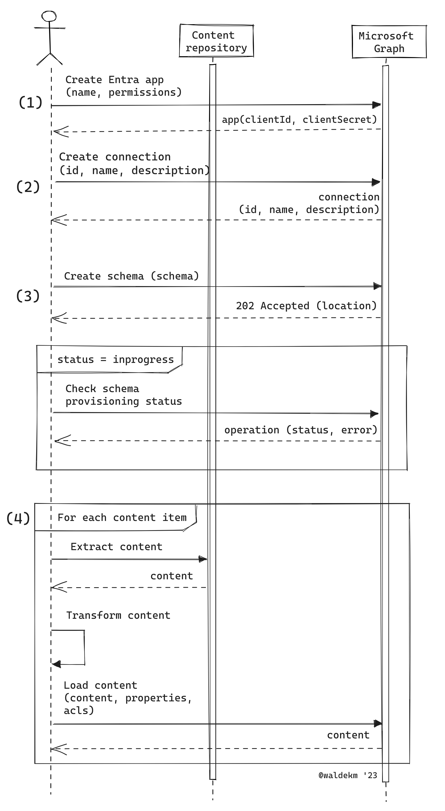

# Use the Microsoft Graph connectors API to index data

[!INCLUDE [beta-disclaimer](../../includes/beta-disclaimer.md)]

You can use Microsoft Graph connectors to index custom items into Microsoft Graph. This allows them to participate in Microsoft 365 intelligent experiences like [Microsoft 365 Copilot](/microsoft-365-copilot/microsoft-365-copilot-overview) and [Microsoft Search](/microsoftsearch/overview-microsoft-search).

Requests to index data are performed on behalf of an application without the presence of a signed-in user, identified using an [access token with application permission](/graph/auth-v2-service).

## Common use cases

The use cases for the APIs in this section involve building [Microsoft Graph connectors](/microsoftsearch/connectors-overview), which involves the following primary steps:

1. [Create a connection](../api/externalconnectors-external-post-connections.md) to an external data source.
2. [Create and register a schema](../api/externalconnectors-externalconnection-patch-schema.md) that describes the type and how to index the external data.
3. [Index the data](../api/externalconnectors-externalconnection-put-items.md) as an external item.

| Use cases                                        | REST resources                              | See also |
|:-------------------------------------------------|:--------------------------------------------|:--|
| **Configuration actions**                        |                                             |   |
| Create, update, or delete a connection           | [externalConnection](externalconnectors-externalconnection.md) | [externalConnection methods](externalconnectors-externalconnection.md#methods) |
| Register a schema for the external data          | [schema](externalconnectors-schema.md)                         | [schema methods](externalconnectors-schema.md#methods) |
| **Indexing actions**                             |                                             |   |
| Add, update or delete a custom item in the index | [externalItem](externalconnectors-externalitem.md)             | [externalItem methods](externalconnectors-externalitem.md#methods) |

## Build a custom Microsoft Graph connector

Building a custom Microsoft Graph connector involves four steps:

1. Create an Entra ID (formerly known as Azure Active Directory) app registration. Along with the request to Microsoft Graph, you submit the name of the app registration and API permissions that your app needs. Microsoft Graph responds with information about the newly created app registration.
2. Create an external connection. Each connection requires a unique ID, name, and a description.
3. Create the schema for the external connection. The schema defines the shape of external content that you'll ingest through this Microsoft Graph connection. Creating the schema is a long-running operation. After you submit the schema to create the connection, Microsoft Graph responds with a URL that you can use to check the status of the operation. The schema is being provisioned as long as the operation status is `inprogress`. When provisioning completes, the operation will return a `completed` status.
4. Ingest external content. For each external item, extract it from the source content repository, transform it so that it matches the schema for your external connection, and submit it to Microsoft Graph as an external item. Along with the item, include information about who's allowed to access it, also known as the access control list (ACL).

The following is a sequence diagram that illustrates the four steps to build a Microsoft Graph connector.

## Known limitations

The following are current known limitations:

- Organizations are limited to a maximum of 10 connections. (If you need more connections, complete the [Request form](https://aka.ms/GraphConnectorsHigherCapacity).)
- You can create up to 25 **externalItem** resources items per second.
- An application is limited to 25 concurrent operations on a connection.
- Connections have a capacity limit of 5,000,000 items or ~350 GB of data.
- Maximum size of an **externalItem** entity is 4 MB.
- Sorting results is not supported.

## Next steps

- See the [Microsoft Graph connectors overview](https://learn.microsoft.com/graph/connecting-external-content-connectors-overview).
- Drill down on the methods, properties, and relationships of the [externalConnection](externalconnectors-externalconnection.md), [schema](externalconnectors-schema.md), and [externalItem](externalconnectors-externalitem.md) resources.
- Check out the [Microsoft Graph postman collection](https://www.postman.com/microsoftgraph/workspace/microsoft-graph/folder/455214-66cbb476-ad94-448e-ba5a-ef58e1da7a90?ctx=documentation).
- Check out the [sample search connector](https://github.com/microsoftgraph/msgraph-search-connector-sample).

