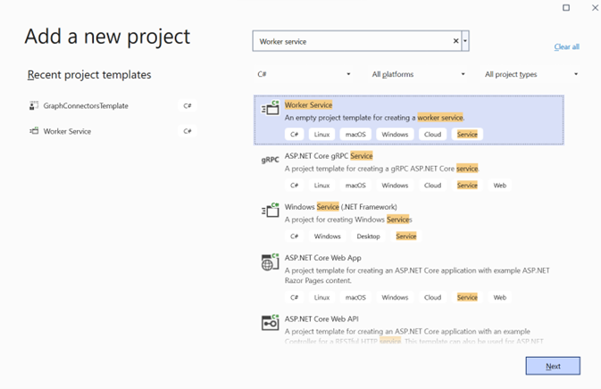

# Host a Microsoft Graph connector as a Windows service

This article describes how to host your Microsoft Graph connector as a Windows service so that it will run continuously.

The connector executable must be always running so that the connector platform can make requests to it during crawls or to perform any connection management operations. The executable won't be actively consuming any resources except for the times when the connector is being crawled. The rest of the time, the connector executable will just be idle.

One way to make the connector executable run continuously is to host it as a Windows service. If the executable is registered as a Windows service, the operating system will take care of starting the process, and restarting it if the system crashes.

Use the following steps to host the connector as a Windows service:

1. Right-click the solution that contains the custom connector project and select **Add** > **New project**.

2. Search for the **Worker service** template, select it, and then choose **Next**.

    

3. Name the project **CustomConnectorWorkerService** and choose **Next**.

4. Choose **.NET Core 3.1** as the target framework and choose **Create**.

5. Right-click the worker service project and choose **Open in Terminal**.

6. Run the following commands in the terminal.

    ```dotnetcli
    dotnet add package Microsoft.Extensions.Hosting --version 6.0.0
    dotnet add package Microsoft.Extensions.Hosting.WindowsServices --version 6.0.0

    ```

7. Right-click the worker service project and select **Add** > **Project Reference**.

8. Select the **CustomConnector** project and choose **OK**.

    

9. Replace the code in the **Worker.cs** file with the following code.

    ```csharp
    using CustomConnector.Server;
    
    using Microsoft.Extensions.Hosting;
    using Microsoft.Extensions.Logging;
    
    using System.Threading;
    using System.Threading.Tasks;
    
    namespace CustomConnectorWorkerService
    {
        public class Worker : BackgroundService
        {
            public Worker(ILogger<Worker> logger)
            {
                var server = new ConnectorServer();
                server.StartLogger();
                server.Start();
            }
    
            protected override async Task ExecuteAsync(CancellationToken stoppingToken)
            {
                while (!stoppingToken.IsCancellationRequested)
                {
                    await Task.Delay(1000);
                }
            }
        }
    }

    ```

10. Replace the code in the **Program.cs** file with the following code.

    ```csharp
    using Microsoft.Extensions.DependencyInjection;
    using Microsoft.Extensions.Hosting;
    
    namespace CustomConnectorWorkerService
    {
        public class Program
        {
            public static void Main(string[] args)
            {
                CreateHostBuilder(args).Build().Run();
            }
    
            public static IHostBuilder CreateHostBuilder(string[] args) =>
                Host.CreateDefaultBuilder(args)
                .UseWindowsService()
                    .ConfigureServices((hostContext, services) =>
                    {
                        services.AddHostedService<Worker>();
                    });
        }
    }

    ```

11. Select the **Release** configuration and build the **CustomConnectorWorkerService** project.

    

12. Run the following script to register and start the custom connector as Windows service.

    ```powershell
    $ServiceName = "CustomConnector"
    $ExePath = "<Full path of CustomConnectorWorkerService.exe from above build>"
    # Create a service with the given executable. This just creates an entry for this service.
    sc.exe create $ServiceName binPath="$ExePath" start="delayed-auto"
    # Set the service to run under a virtual account NT Service\<ServiceName>. Optionally skip this step to run the service under LOCAL SYSTEM account
    sc.exe config $ServiceName obj="NT Service\$ServiceName"
    # Restarts service after 5 minutes on first, second and third failures and resets error after 1 day
    sc.exe failureflag $ServiceName 1
    sc.exe failure $ServiceName reset= 86400 actions= restart/300000/restart/300000/restart/300000
    sc.exe start $ServiceName

    ```

    >[!Note]
    >- The service name must be unique for each unique connector.
    >- Refer [Service User Accounts](/windows/win32/services/service-user-accounts) to understand more about Service User Accounts

13. Open services.msc and verify that the service is running.

    

For any issues with hosting the connector, see [Troubleshooting errors](/graph/custom-connector-sdk-troubleshooting#troubleshooting-errors-while-hosting-the-connector-as-a-windows-service).

## Next steps

* [Publish a connection for your custom connector](/graph/custom-connector-sdk-sample-publish)
