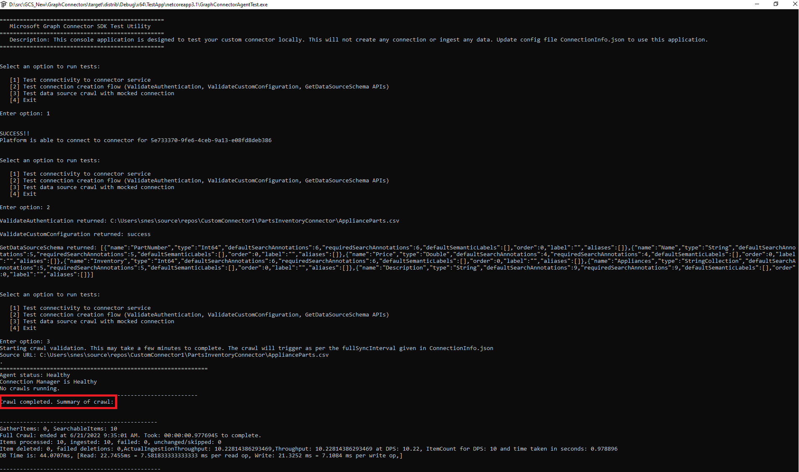

# Microsoft Graph connectors SDK test application

The GraphConnectorAgentTest executable file is a test utility for the custom connector. It doesn't create connections or adds data into Microsoft's index. The test utility runs on the machine where you installed the agent and doesn't connects to external resources except the data source that is part of the test.
You can find the test application inside the "TestApp" folder present in your Graph connector agent installation folder.

Update the following configuration files to use this test utility:

**ConnectionInfo.json**: this file holds all information of the connection: the connector ID identifying the custom connector for which this connection is being created, the data source URL, credentials to access the data source, the schema associated with the connection, and extra parameters for the connection.

You can find this configuration file inside the "Config" folder of the test application.

**CustomConnectorPortMap.json**: after creating the custom connector, add the mapping of the connector ID and the port on which it's running in this file. You can add multiple connector IDs and their corresponding port information in this file. Each unique connector should be running on a different port.

You can find this file in your Microsoft Graph connector agent installation folder.

After creating the custom connector, add the mapping of the connector ID and the port on which it's running in the CustomConnectorPortMap.json.

>[!Note]
>You can add multiple connector IDs and their corresponding port information with \<Connector Id>:\<Port> format in this file. Each unique connector should be running on a different port.

## Test scenarios

This test utility has three options:

**1. Testing the connectivity to the connector service**: this option verifies if it can connect to the connector specified in ConnectionInfo.json over the port specified for that connector ID in CustomConnectorPortMap.json.

**2. Test connection creation flow** (ValidateAuthentication, ValidateCustomConfiguration, GetDataSourceSchema APIs): this option is to validate the methods specified in ConnectionManagementService. It invokes each of the mentioned methods and displays their results on the console.

**3. Test data source crawl with mocked connection**: this option tests the methods in ConnectorCrawlerService. It invokes the crawl with the schedule in ConnectionInfo.json and prints the status of the ongoing or last completed crawl every minute. When the first crawl finishes successfully, it displays the message that crawl has completed, and the platform keeps running to trigger further crawls specified at the interval in ConnectionInfo.json. If you specify an incremental crawl frequency ConnectionInfo.json file, it triggers the incremental crawl after the first full crawl.

Closing and restarting the GraphConnectorAgentTest executable file stops the platform from crawling, and enables testing of other options. It also allows you to retest an option after changing the connector code, or the configuration files.

## Working of the GraphConnectorAgentTest executable

When you open the GraphConnectorAgentTest executable file, it reads the ConnectionInfo.json configuration file. After selecting one of the test options, it will try to connect to the specified connector over the port that was indicated in the CustomConnectorPortMap configuration file. After successful connection, the platform calls the respective methods pertaining to the test option.

Specify the credentials to access the data source in the ConnectionInfo.json configuration file to use test option 2 or 3. The platform reads the credentials and passes them down to the connector to access the data source. As long as no external person gets access to the ConnectionInfo.json configuration file, the credentials are secure.

## See also

* [Best practices to follow while developing your connector](/graph/custom-connector-sdk-best-practices)

* [Troubleshooting issues with your connector](/graph/custom-connector-sdk-troubleshooting)
