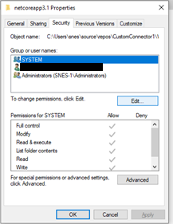
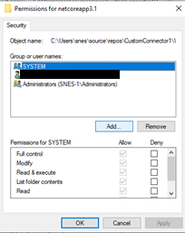
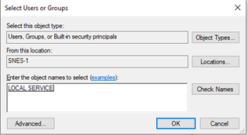
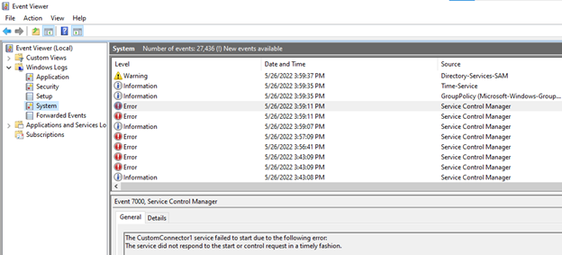

# Microsoft Graph connectors SDK troubleshooting

In this article, you can find some of the most common issues with the Microsoft Graph connectors SDK, and how to troubleshoot them.

## Troubleshooting items missing from the index

If previously present items are missing from the index, it could be due to the delete detection logic in the platform.
The items missing from a success response in [OperationStatus](/graph/custom-connector-sdk-contracts-common#operationstatus) but already in the index will be removed from the index.
If the connector sends transient failure responses too, and more than 10% of the items have resulted in crawl failures, the items that aren't seen in the last 2 crawls will get deleted.

## Updating port mapping configuration file

When the connector needs to run on a different port, the port map configuration file has to be updated with the new values. Whenever port map configuration file is edited the GCA service must be restarted for the changes to take effect. To restart this, open services.msc and restart GcaHostService:

## Troubleshooting connector service unavailability

If the crawls are failing with connector unavailable on specified port, check the following scenarios:  

1. The connector is indeed running on the specified port and hasn't crashed or got stuck.

2. The port specified in the port map configuration file is correct.

3. If the port map configuration file has been edited, make sure that the GcaHostService was restarted as mentioned in [Updating port mapping configuration](#updating-port-mapping-configuration-file).

## Handling RPC errors

If you see any RPC errors during the communication between the Graph connector Agent platform and the connector, check [this](https://grpc.github.io/grpc/core/md_doc_statuscodes.html) page to see the explanation of RPC error codes.

If the error code is Unknown, the most likely reason is that there's some unhandled exception in your connector code. Make sure you provide a proper response is sent with success/failure operation status in all cases.

## Troubleshooting errors while hosting the connector as a windows service

### Starting service failed due to Access denied error

Make sure the path of the executable is accessible to Local System account.

1. Select and hold (or right-click) the folder containing the executable and choose Properties.

2. Open Security tab and select on Edit under Group or user names

    

3. Select on Add

   

4. Enter LOCAL SERVICE as the object name and select on Check Names

    

5. Select OK in all the dialog boxes.

### Starting service fails with any error

Check the error logs from event viewer. Search for event viewer app and open it. Check for error logs under **Windows logs > Application** and **Windows logs > System**

