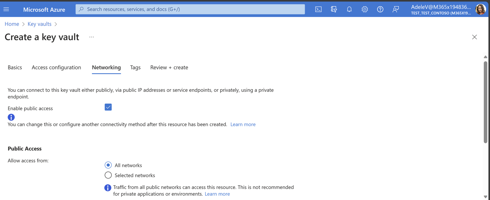
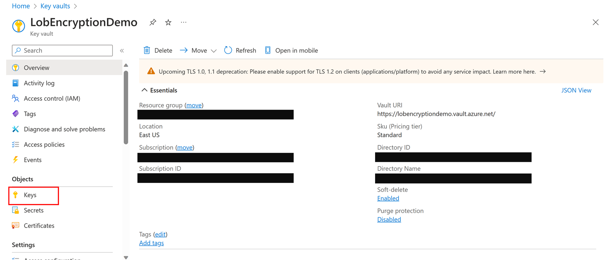

# Encryption with Microsoft Graph Data Connect

Microsoft Graph Data Connect (Data Connect) offers encryption capabilities through encryption-at-rest and encryption-in-transit. With [Azure Key Vault (AKV)](https://learn.microsoft.com/en-us/azure/key-vault/general/basic-concepts), customers can generate and store their public and private keys in AKV and refresh them when needed. Additionally, we offer out-of-the-box custom encrypted datasets as well. This article focuses on how to enable custom encryption for datasets within Data Connect 

1. **Encryption for data-at-rest**: We recommend customers use the [Azure data-at-rest](https://learn.microsoft.com/en-us/azure/security/fundamentals/encryption-atrest) encryption feature and customer managed keys when setting up their Azure storage account to ensure it's properly locked and secure after data delivery. 

2. **Encryption for data-in-transit**: Data Connect offers encryption for data-in-transit through our custom dataset encryption capability. It also ensures ALL data requests between a customer’s Microsoft 365 and Azure resources are secure using service standards such as HTTPS that are [SOC approved.](https://docs.microsoft.com/en-us/compliance/regulatory/offering-soc-2)

# Enabling Custom Encryption with Microsoft Graph Data Connect

This article guides you through setting up custom encryption for secure data delivery with Data Connect.
Customers can use custom encryption for secure dataset delivery. Link your Azure Key Vault (AKV) during application registration to enable encryption. Data Connect encrypts datasets using authorized public keys and delivers them encrypted with a decryption key.

Set up custom encryption by generating keys in AKV or linking an existing AKV. Enable encryption when setting up a new Data Connect application or edit an existing one.

> [!NOTE]
> Custom Encryption is not available to customers who are still using the PAM consent process or using MDF (Managed Data Flows).

## Enabling Encryption for your Data Connect Application.

1. For existing applications: log into your [Azure Portal](www.azure.portal.com). 
    1. Click on **Microsoft Graph Data Connect** and select your current application. 
    2. Click **properties** and then toggle on encryption. 
    3. Drop down and select your Azure Key Vault URI (name of the AKV) or follow  step 3.4 and 3.5 to create a new AKV. Then **Update Properties** to save. 
    4. Follow step 5 to ensure you AKV has the correct role permissions and populate it with the correct RSA keys.
    
    
    

2. If you don't have an existing Data Connect Application, follow our [Getting Started](../includes/data-connect-quickstart-01.md) using [the simplified onboarding experience.](./onboarding-experience-overview.md). 

3. Fill out the application details on the **Registration Info** page.
    1. Under **Publish Type** select **Single Tenant** if you intend to enable encryption as on. 
    2. Next, **Enable encryption for datasets**.
    > [!NOTE]
    > Encryption will apply to ALL the eligible datasets requested in the application. Click on the tool tip next to encryption to learn which datasets are elgible.
    3. For **Key Vault**, drop down and select the AKV URI (name of the AKV).
    4. If your AKV doesn't exist, open a new tab and follow the steps in ["Setting up your Azure Key Vault" tab.](./data-connect-custom-encryption.md#using-azure-key-vault-for-custom-encryption). 
    5. Once you have set up your AKV, go back to your Data connect application tab and look for your AKV in the drop down to select it. You may need to refresh the page for the AKV to populate in the dropdown.

     

4. Fill out the rest of the required application details as mentioned in the [Getting Started](../includes/data-connect-quickstart-01.md) and [simplified onboarding experience.](./onboarding-experience-overview.md) and submit it for your M365 admin to review. 
    
    > [!NOTE]
    > Make sure to create or note down your existing service principal (SPN) on notepad, you will need this at a later step!

5. Once your M365 Admin has reviewed and approved your app, please follow the steps in ["Using your Azure Key Vault" and "Generating RSA keys with your Azure Key Vault" tab](./data-connect-custom-encryption.md#using-azure-key-vault-for-custom-encryption) to ensure your AKV has the correct role permissions and is populated with RSA keys.

6. Continue to set up your pipeline for data extraction and submit your data request. Encryption will be applied to all the eligible datasets in the application. If you run a pipeline without completing step 5, your requested data will not be encrypted.

## Using Azure Key Vault for Custom Encryption

Follow the steps in "Setting up Azure Key Vault" tab as prerequisite before moving onto the next tab if you don't have an AKV set up.

Once you have an existing AKV, hover over "Using your existing Azure Key Vault" tab and enable the correct role permissions required. Finally, click "Generating RSA keys with your Azure Key Vault" tab to create the required RSA keys in your AKV for custom encryption.

No action is required from the Microsoft 365 admin for this section.

# [Setting up your Azure Key Vault](#tab/SettingUpAKV)

1. Log into your [Azure portal](https://ms.portal.azure.com) with your developer credentials and click on the **Azure Key Vault** icon
    

2. If you don't have an existing AKV, hover over to **Create**. Learn more about how to [create a new instance of AKV.](https://learn.microsoft.com/en-us/azure/key-vault/general/quick-create-portal) 
    

3. Click **Azure role-based access control (recommended)** underneath **Permission model** for the later steps to apply. 
    

4. **Enable public access** in the **Networking** tab to allow Data Connect to access any public keys generated and stored. Data Connect is authorized only to access select public keys. 
    

5. Follow through the steps and select **Review + Create** when done.

# [Using your Azure Key Vault](#tab/ExistingAKV)

1. Log into your [Azure portal](https://ms.portal.azure.com) with your developer credentials and click on the **Azure Key Vault** icon
    

2. Click on your Azure Key Vault. In this example, we use **LoBEncryption Demo**.
    

3. Hover over **Access Control (IAM)** and click on **Add**.
    

4. Click **Add role assignment** within **Add**.
    

5. Once you are on the Role Assignment page, within **Role**, type in "Key Vault Crypto User" and select it. Click **Next** when done.
    

6. Move onto the **Members** tab and enable **Assign Access to** "Users, group, and service principal" and the click on "+ Select Members". Select the correct service principal (Data Connect application name) through the window pane on the left. This step ensures that your Data Connect application can connect to your Azure Key Vault. Click **Next** when done.
    

7. Review the details within the **Review + assign** tab and click on **Review + Assign** button on the right-below corner. Your Azure Key Vault can now connect to your Data Connect Application

# [Generating RSA keys with your Azure Key Vault](#tab/AKVKeys)

1. Hover over to the main Key Vaults page and click on your Azure Key Vault that you set up from the previous steps. In this example, we use **LoBEncryption Demo**.
    

2. Select **Keys** within the left window pane of your AKV.

    

3. Click on **Generate/Import**
    

4. Generate a RSA key and name your key to be your Azure Active Directory (AAD) tenant ID. Ensure it's has a unique name (there should only be one key per respective AAD tenant ID).
    

    > [!NOTE]
    > The RSA key must be set to 2048 bits for key size and have a listed expiration date or else it will not be valid. 

5. Click on **Create** when you're done filling out the details!
