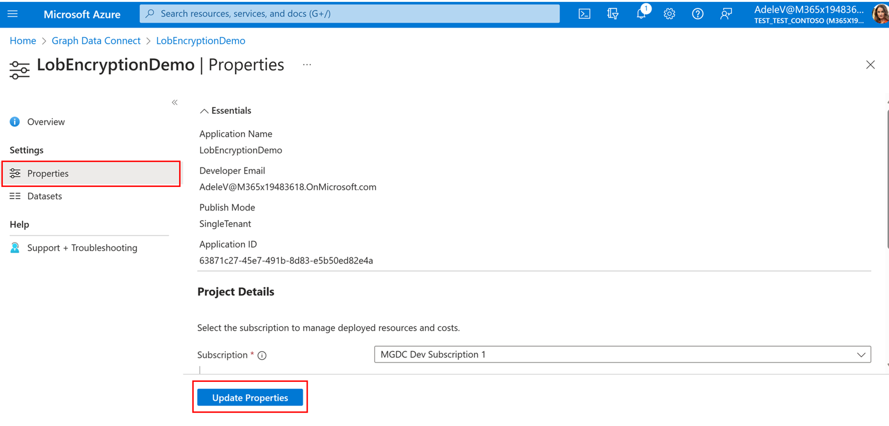
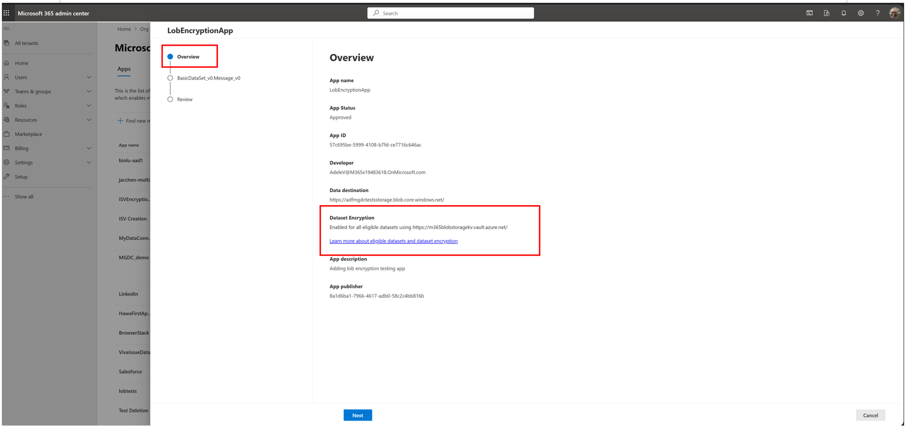
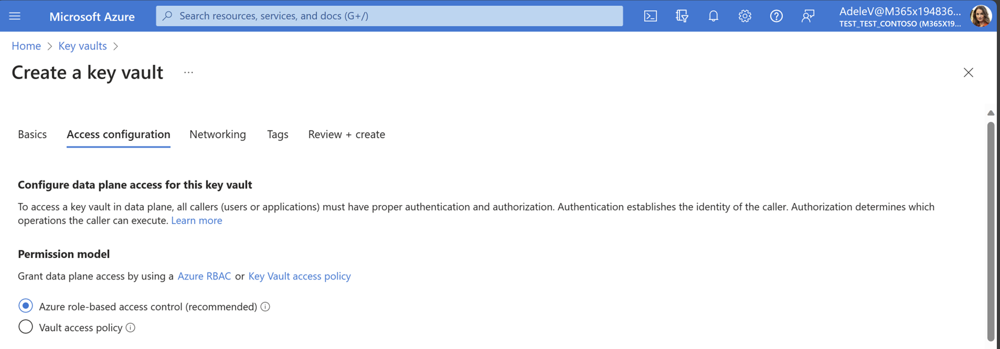

# Use encryption with Microsoft Graph Data Connect

Microsoft Graph Data Connect (Data Connect) offers encryption capabilities through encryption-at-rest and encryption-in-transit. With [Azure Key Vault (AKV)](https://learn.microsoft.com/en-us/azure/key-vault/general/basic-concepts), customers can generate and store their public and private keys in AKV and refresh them when needed. Custom encrypted datasets are also available. This article guides you through setting up custom encryption for a secure data delivery with Data Connect. 

- **Encryption for data-at-rest**: We recommend customers use the [Azure data-at-rest](https://learn.microsoft.com/en-us/azure/security/fundamentals/encryption-atrest) encryption feature and customer managed keys when setting up their Azure storage account to ensure that it's properly locked and secure after data delivery. 

- **Encryption for data-in-transit**: Data Connect offers encryption for data-in-transit through our custom dataset encryption capability. It also ensures that all data requests between a customer’s Microsoft 365 and Azure resources are secure by using service standards that are [SOC approved](/compliance/regulatory/offering-soc-2), such as HTTPS.

## Enabling Custom Encryption with Microsoft Graph Data Connect

Customers can use custom encryption for secure dataset delivery. Link your Azure Key Vault (AKV) during application registration to enable encryption. Data Connect encrypts datasets using authorized public keys and delivers them encrypted with a decryption key.

Set up custom encryption by generating keys in AKV or linking an existing AKV. Enable encryption when setting up a new Data Connect application or edit an existing one.

> [!NOTE]
> Custom encryption is not available to customers who are still using the PAM consent process or Managed Data Flows (MDF).

## Enable custom encryption for your Data Connect application

If you have an existing Data Connect Application, follow the steps below:

1. Sign in to the [Azure Portal](https://ms.portal.azure.com). 
    1. Choose **Microsoft Graph Data Connect** and select your current application. 
    2. Choose **properties**. Choose **Single Tenant** and toggle on encryption. 
    3. In the drop-down menu, select your Azure Key Vault URI (name of the AKV) or follow steps 2.d and 2.e in the next section to create a new AKV. Then choose **Update Properties** to save. 
    4. Follow step 4 in the next section to ensure that your AKV has the correct role permissions and populate it with the correct RSA keys.
    5. Ensure that your pipelines run after step 5 is complete or else your data request will not deliver encrypted data.

    
    
    

If you don't have an existing Data Connect application, use the following steps to create one:

1. Follow our [Getting Started](https://learn.microsoft.com/en-us/graph/data-connect-quickstart?tabs=NewConsentFlow%2CPAMMicrosoft365%2CAzureSynapsePipeline) using [the simplified onboarding experience.](./onboarding-experience-overview.md) to build your Data Connect Application.

2. Fill out the application details on the **Registration Info** page.
    1. Under **Publish Type** select **Single Tenant** if you intend to enable encryption as on. 
    2. Choose **Enable encryption for datasets**.
    3. For **Key Vault**, from the drop-down menu, select the AKV URI (name of the AKV).
    4. If your AKV doesn't exist, open a new tab and follow the steps in [Setting up your Azure Key Vault](./data-connect-custom-encryption.md#using-azure-key-vault-for-custom-encryption). 
    5. Go back to your Data Connect application tab and look for your AKV in the dropdown to select it. You might need to refresh the page for the AKV to populate in the dropdown.

    > [!NOTE]
    > Encryption will apply to all the eligible datasets requested in the application. Choose the tool tip next to encryption to learn which datasets are eligible.

     

3. Fill out the rest of the required application details as mentioned in the [Getting Started](https://learn.microsoft.com/en-us/graph/data-connect-quickstart?tabs=NewConsentFlow%2CPAMMicrosoft365%2CAzureSynapsePipeline) and [simplified onboarding experience](./onboarding-experience-overview.md) and submit it for your Micorosoft 365 admin to review. 
    
    > [!NOTE]
    > Make a note of your existing service principal; you will need this later.

4. After your admin reviews and approves your app, follow the steps in ["Using your Azure Key Vault" and "Generating RSA keys with your Azure Key Vault" ](./data-connect-custom-encryption.md#using-azure-key-vault-for-custom-encryption) to ensure that your AKV has the correct role permissions and is populated with RSA keys.

5. Continue to set up your pipeline for data extraction and submit your data request. Encryption will be applied to all the eligible datasets in the application. If you run a pipeline without setting up the correct role permissions and generating RSA keys, your requested data will not be encrypted.

## Dataset decryption after data delivery

After encrypted data is delivered, the customer is responsible for data decryption. Data Connect does not decrypt data after delivery. This section describes how to decrypt data after delivery.

### Prerequisites

Ensure that your Azure Key Vault is set up correctly; for details, see [Using Azure Key Vault for custom encryption](./data-connect-custom-encryption.md#using-azure-key-vault-for-custom-encryption). 

### Metadata and encryption

The public part of the RSA key pair is used to encrypt the decryption key. You can use its corresponding private part to decrypt the decryption key after data delivery. Microsoft stores your decryption key; only your application can decrypt the decryption key by using the private key. Only you have access to the private key. The decryption key is an AES 256-bit symmetric key used to encrypt the file. 

Your application needs to reverse the encryption and compression process to access the original data. To access the customer data from the data drop:

1. Get the file decryption key from the extraction metadata.

2. Decrypt the encryption key with the customer private key (provided in the Azure Key Vault). For more information, see [Azure Key Vault decrypt API](/rest/api/keyvault/keys/decrypt/decrypt?view=rest-keyvault-keys-7.4&tabs=HTTP).

3. Decrypt the file by using the file encryption key. For a C# example, see [Encrypting data](https://learn.microsoft.com/en-us/dotnet/standard/security/encrypting-data).

### Metadata file

After extraction, you’ll receive a data drop. Each data drop includes an encryptionKeyDetails.json file, with a metadata/MoreMetadata/EncryptedDatasets path in the root directory. This JSON file includes details about the copy activity. The following table describes the schema.

| Field | Description |
| --- | --- |
| DecryptionKeyDetails | The details about the decryption key. |
| PublicKeyVersion | The version of the public key. This is needed for the partner to identify which version of the corresponding private key they should use for decryption. |
| DecryptionKeyValue | The Base64 representation of the decryption key’s value. |
| DecryptionKeyIV | The Base64 representation of the initialization vector used to create the decryption key. |

### Decryption keys

The decryption key comes encrypted as a Base64 string with the per-customer tenant public key provided in the Azure Key Vault. Decryption keys consist of the following components:

- value – The Base64 representation of the value of the decryption key. For example: `oF8xFGjrhxC2LsrsrUA3eTCWDl2fYlBkUe886jRLnKFwdbH/9SRA+55ekL42JCcL+iXsQNZdMWmy3LnLgk2nSfZ96ecU/++sOM7QB/6kWrS2Wmg+5XCW5FErodnyBZKCbOo1RETgrxTH8YlcoLX5319VCmBleSMxgitn0Jl+VCM+NjfE87oPWyLo+vifaBtFnIgSOkzKh20dZm/Ue1AxXQlYQ/WptHBRa4Lmza/oXgbTpqk9Y+Mw+4IhVtHbCdcEt0DqQ0FRb/qjlwMPaYqOlZ5GxFTiQFsAtYVTpnvcffkDBp1gzlOL2iLhudc66PP4h6v4cBxHx6RTz8bO4KiaQg==`
- iv – The Base64 representation of the initialization vector used to create the decryption key. For example: `vLvaqqAN8GaYI9gGuX1bsQ==`

### Encoding

There are a few encoding details to be aware of during the decryption process. The following data contains these encoding types:

- Decryption Key: UTF-8
- Decryption Key IV: UTF-8
- Padding for AES – CBC / PKCS5 PKCS7 in C# is the same as PKCS5 in Java

Also, the output of the Azure Key Vault Decrypt REST API is Base64 URL encoded. You'll need to decode the value from Base64 URL to bytes, and then encode the result to Base64.

Be sure to take these encoding differences into account when you decrypt the data. If encoded data is incorrectly decrypted, you might get an error like this: Invalid AES key length: 88 bytes.

## Dataset eligiblity for encryption

The following (datasets)[https://learn.microsoft.com/en-us/graph/data-connect-datasets] are eligible for encryption for Data Connect: 

- All datasets for Azure Active Directory
- All datasets for Outlook and Exchange Online
- All datasets for Microsoft Teams
- All datasets for Microsoft Groups
- All datasets for OneDrive and SharePoint

The following datasets are not yet eligible for encryption:

- All datasets for Viva Insights

> [!NOTE]
> If your application has encryption enabled and contains a mix of eligible and non-eligible datasets, only the eligible datasets will be encrypted.

## Admin app approval 

Admins use the following process to approve Data Connect apps:

1. Sign in to the [Microsoft 365 admin authorization portal](https://admin.microsoft.com/Adminportal/Home#/Settings/MGDCAdminCenter) with your admin credentials.

2. Choose the **Security & Privacy** tab in **Org settings**, and then select **Microsoft Graph Data Connect applications**, as shown in the following image.
    

3.	Select the application that is ready for review. In the **Overview** section of the application details, ensure that encryption is enabled. 
    

4.	On the **Review** section of the application details, ensure encryption is selected and review the datasets. 
    > [!NOTE]
    > If encryption is enabled during app registration, it will apply to all the eligible datasets in the app.

    

5.	After you review the application, select **Approve, Decline, or Cancel**. An action must be taken and Data Connect will only apply encryption after the app is approved. For more information, see [app authorization.](./app-authorization.md)

## Using Azure Key Vault for custom encryption

If you don't have an AKV set up, follow the steps in the Setting up Azure Key Vault tab before you proceed to the next tab.

After you have an existing AKV, go to the Using your Azure Key Vault tab to enable the required role permissions. Then go to the Generating RSA keys with your Azure Key Vault tab to create the required RSA keys in your AKV for custom encryption.

No action is required from the Microsoft 365 admin to enable custom encryption.

# [Setting up your Azure Key Vault](#tab/SettingUpAKV)

1.Sign in to the [Azure portal](https://ms.portal.azure.com) with your developer credentials and choose the **Azure Key Vault** icon.
    

2. If you don't have an existing AKV, choose **Create**. For more information, see [Create a key vault using the Azure portal](/azure/key-vault/general/quick-create-portal).
    

3. Choose **Azure role-based access control (recommended)** under **Permission model**. 
    

4. On the **Networking** tab, choose **Enable public access** to allow Data Connect to access any public keys that were generated and stored. Data Connect is authorized only to access select public keys. 
    

5. Follow the steps and select **Review + Create** when done.

# [Using your Azure Key Vault](#tab/ExistingAKV)

1. Sign in to the [Azure portal](https://ms.portal.azure.com) with your developer credentials and choose the **Azure Key Vault** icon.
    

2. Choose your Azure Key Vault; for example, **LoBEncryption Demo**.
    

3. On the **Access Control (IAM)** tab, choose **Add**.
    

4. Choose **Add role assignment**.
    

5. On the **Role** tab, type **Key Vault Crypto User** and select it, and then choose **Next**.
    

6. On the **Members** tab, enable **Assign Access to** for **Users, group, and service principal**, and choose **+ Select Members**. 

7. On the left pane, select the correct service principal (the Data Connect application name). This ensures that your Data Connect application can connect to your Azure Key Vault. Choose **Next**.
    

7. Review the details on the **Review + assign** tab and choose **Review + Assign** on the lower right corner. Your Azure Key Vault can now connect to your Data Connect application.

# [Generating RSA keys with your Azure Key Vault](#tab/AKVKeys)

1. Go to the main Key Vaults page and choose your Azure Key Vault; for example, **LoBEncryption Demo**.
    

2. Select **Keys**.

    

3. Choose **Generate/Import**.
    

4. Generate an RSA key and name your key to be your Microsoft Entra tenant ID. Make sure that it has a unique name (you should only have one key per Microsoft Entra tenant ID).
    

    > [!NOTE]
    > The RSA key must be set to 2048 bits for key size and must have an expiration date or it won't be valid. 

5. Fill out the details and choose **Create**.

