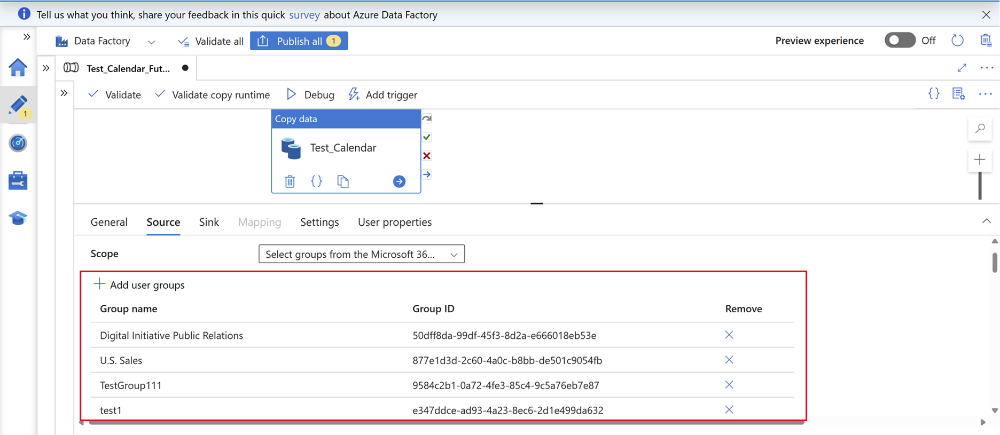

# Groups in Microsoft 365

In the [Groups](https://learn.microsoft.com/en-us/microsoft-365/admin/create-groups/compare-groups?view=o365-worldwide) section of the Microsoft 365 admin center, you can create and manage these types of groups. 

*  **Microsoft 365 Groups** are used for collaboration between users, both inside and outside your company. They include collaboration services such as SharePoint and Planner.
* **Distribution groups** are used for sending email notifications to a group of people.
* **Security groups** are used for granting access to resources such as SharePoint sites.
* **Mail-enabled security groups** are used for granting access to resources such as SharePoint and emailing notifications to those users.

# Scope selection in MGDC
  MGDC provides two categories of data for scope selection. Please consider the guidance below to adjust your MGDC pipeline parameters to acquire data.

## User-scoped datasets
1. User-scoped datasets can be Messages, Events, Users, etc.
2. Scope Options:

    * **All users in the tenant**: returns data for all the users in the tenant. More information can be found [here](/graph/data-connect-filtering.md).
    * **All users in the tenant with a scope filter**: returns data for all the users in the tenant that are part of the scope filter applied. 
        1. Scope Filter can help filter down the users desired, if left empty it returns all the data of the users. More information can be found [here](/graph/data-connect-filtering.md).
    *	**Select groups from the Microsoft 365 tenant**: data is extracted for individual users in the mentioned group from scope.

3.	Groups can be distribution groups, security groups, or M365 groups.
4.	MGDC expands the list of users from the scoped groups provided and then extracts data for each of those users. 
5.	**Example**:  The customer wants to extract the Messages dataset and creates a security group of users A, B, and C in a tenant of 500 users, and passes this group. MGDC expands the provided security group into a list of users, extracts the messages data for those three users and delivers the data for those users to the customer. The customer will only receive the messages dataset for individual users A, B, and C out of their tenant of 500 users.
        
## Group-scoped datasets
1.	Group-scoped datasets can be Outlook Group Conversations, Teams Channel Messages, Group Details, etc.
2.	Scope Options:
    * **All groups in the tenant**: returns data for all the groups in the tenant.
    * **All groups in the tenant with a scope filter**: returns data for all the groups in the tenant with the scope filter applied. Scope Filter can help filter down the groups desired. 
    *   **Select groups from the Microsoft 365 tenant**: returns collective data of the selected groups. MGDC looks for data associated with those specific groups rather than the individuals of the group. 
1.	Groups can either be distribution groups, security groups or M365 group.  The types of groups supported varies based on which dataset is being requested. Please refer to the table below for the correct dataset for group mapping.

    |                                       | M365 Groups | Distribution Groups | Security Groups | Mail-Enabled Security  |
    |---------------------------------------|-------------|---------------------|-----------------|------------------------|
    | TeamsStandardChannelMessages          | Yes*        | No                  | No              | No                     |
    | TeamsChannelDetails_v0                | Yes*        | No                  | No              | No                     |
    | OutlookGroupConversations             | Yes         | No                  | No              | No                     |
    | GroupDetails                          | Yes         | Yes                 | Yes             | Yes                    |
    |     GroupMembers                      | Yes         | Yes                 | Yes             | Yes                    |
    |     GroupOwners                       | Yes         | Yes*                | Yes*             | Yes                    |
    |     Viva Insights                     | N/A         | N/A                 | N/A             | N/A                    |
    |     OneDrive and SharePoint Online    | N/A         | N/A                 | N/A             | N/A                    |
    |     All other datasets                | Yes         | Yes                 | Yes             | Yes                    |

    *For Teams datasets: M365 groups must also be Teams enabled.
    *For Group datasets: These don’t contain a primary mailbox, their region will be defaulted to their tenant home region. 

2.	**Example**: The customer wants to extract the Group Details dataset with a security group of users A, B, and C out of their tenant of 500 users. Since this is a group scoped dataset, the customer will only receive group details data for the specified group. The customer will NOT receive any individual data for users A, B, and C in the group.

> **NOTE:**  For Teams group-scoped datasets, if the group in scope is not a teams enabled group, then it will return NO data. M365 Groups can be enabled as Teams groups, but distribution groups and security groups are NOT Teams enabled. Please check the steps below to see what type of groups are available to select. 

# How to search and verify for group types

1. Once you have selected the group-scoped dataset, search and add a group(s) or group IDs.
    
    

2. Once you have added groups, you can view the group ID. Please copy the group IDs of the groups you would like to verify.

    

3. In a new tab, go to the [Azure homepage](www.portal.azure.com) and click on "Azure Active Directory".

    

4. Paste the group ID copied from step #2 and click on the Groups tab.

    

5. You can verify the type of group you have once you have clicked on the Groups tab.

    
 
