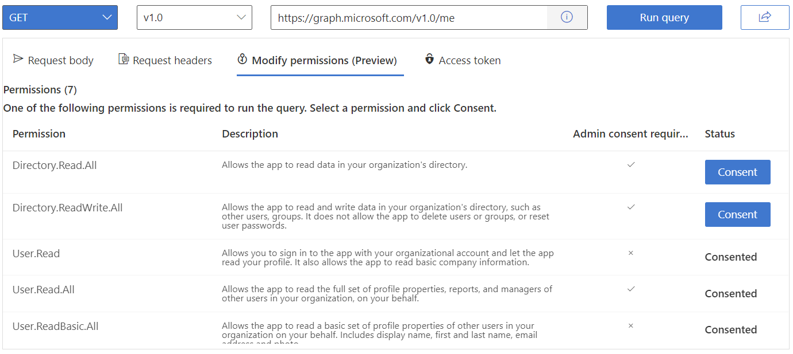
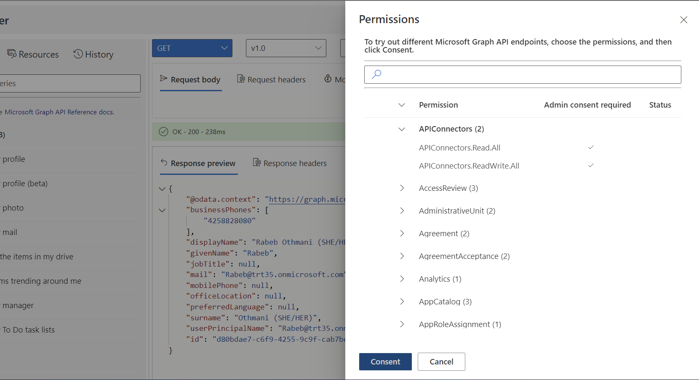
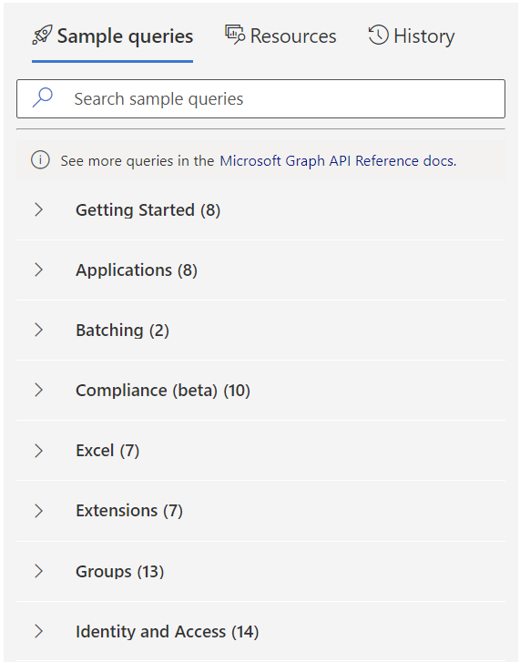
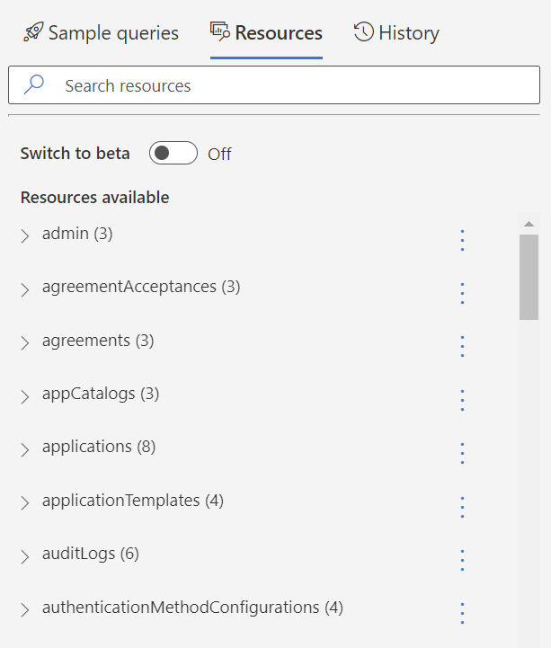

# Work with Graph Explorer

[Graph Explorer](https://developer.microsoft.com/graph/graph-explorer/) is a developer tool that lets you learn about Microsoft Graph APIs. It has a variety of features to help you on your journey. This article describes Graph Explorer's main interface areas and how to use some of the important features.

For an overview, see [Use Graph Explorer to try Microsoft Graph APIs](/graph/graph-explorer/graph-explorer-overview).

## Header

The header allows you to sign in, view the tenant you are using and access your settings, helpful links and the survey to provide feedback for the tool.

- **The avatar** : sign in, view your profile, consent to permissions, switch accounts or sign out of your account. For more on consenting to permissions, see [Consent to permissions](#consent-to-permissions).
- **Feedback** : If you wish to provide feedback, you can fill in the survey form.
- **Help** : Access useful links such as the documentation or the GitHub repo for Graph Explorer.
- **Settings** : Access Graph Explorer settings to change the interface theme or to get a free instant sandbox preconfigured with sample data packs
- **Tenant** : View the tenant you are currently using.

### Consent to permissions

The user or administrator must grant Graph Explorer the correct permissions by using a consent process to access data in Microsoft Graph. You can consent to permissions in Graph Explorer by choosing either the **Modify permissions** tab or the **Consent to permissions** option under the profile avatar when you’re signed in. The **Modify permissions** tab lists all the permissions that might let you run the query in the address bar. When possible, choose the least privileged permission.

To consent to permissions:

1. Select a sample query and run it.
2. Select the **Modify permissions** tab.
3. See the list of permissions required to run the query.
4. Select the **Consent** button next to the permission that you want to consent to.

The **Modify  permissions** feature is currently in preview, and some queries might be missing permissions. If permissions are missing for a query, the **Consent to permissions** option in the avatar gear contains the list of all available permissions:

1. Go the avatar gear and choose the **Consent to permissions** option. This option contains the list of all available permissions.
2. From the list of all the permissions, consent to the ones you want.

## Sidebar

The sidebar allows you to access the main features of Graph Explorer:

- [Sample queries](#get-started-with-microsoft-graph-apis)
- [Resources](#explore-all-of-the-microsoft-graph-resources)
- [History](#store-and-share-queries)

### Get started with Microsoft Graph APIs

To get started with Microsoft Graph and get yourself familiar with Graph Explorer, the **Sample queries** feature provides a set of queries categorized by service that you can select and run.

The query box will be populated by the selected query. You can then make the request by clicking the Run query button.

### Explore all of the Microsoft Graph resources

The Resources feature allows you to explore the resources on Microsoft Graph in their entirety, on both v1.0 and beta versions. Navigate the tree to browse for a specific resource or, alternatively, use the search bar to find it.

With the **Resources** tab you can export a collection of resources into a Postman collection:

1. From the kebab menu next to the resource, select **Add to collection**.
1. Once you complete adding resources, click on the **Preview collection** button.
1. From the collection view, you can review the resources and remove any if you chose to.
1. Click on **Download Postman collection** to download your collection.

### Store and share queries

All queries you run in Graph Explorer are saved for 30 days in the **History** tab. In the **History** tab, you can:

- Export all history items in **.har** format.
- Delete all history items.
- View a history item.
- Run a query.
- Export a history item in **.har** format.
- Delete a history item.

To share queries that you run, select the **Share** button situated next to the Run query button, and then select **Copy**. This copies a shareable link that allows others to see your query and the results.

## Main work area

This area is where you will be spending most of your time on Graph Explorer. This area has everything you need to run a request:

- **Query box**: you can manually build your query.
- **HTTP verbs**: a dropdown list of the HTTP methods.
- **API version**: a dropdown list of the API versions available publicly.
- **Modify permissions**: you need to consent to the right permissions to be able to run a query. For details, see [consenting to permissions](#consent-to-permissions).
- **Access token**: this tab shows your access token when you're signed in. You can copy the token if you need to use it in your favorite REST client application.

 

This is also where you see:

- **Response preview**: You can see the response body here.
- **Response headers**: You can see the response headers here.

On top of query related features, the main work area also contains:

- [Microsoft Graph Toolkit Adaptive cards integration](#microsoft-graph-toolkit-integration)
- [Adaptive cards integration](#adaptive-cards-integration)
- [Code snippets](#leverage-the-power-of-the-client-libraries)

### Microsoft Graph Toolkit integration

The [Microsoft Graph Toolkit](../toolkit/overview.md) is a collection of reusable, framework-agnostic web components and helpers for accessing and working with Microsoft Graph. The components are fully functional, with built-in providers that authenticate with and fetch data from Microsoft Graph.

Graph Explorer allows you to visualize Microsoft Graph Toolkit components that correspond to the API queries. A blue dot on the **Toolkit component** tab indicates that the Toolkit provides a component for the currently specified REST API query in Graph Explorer. You can conveniently copy the code for the component to your app.

### Adaptive cards integration

[Adaptive cards](https://adaptivecards.io/) are platform-agnostic snippets of UI, authored in JSON, that apps and services can openly exchange. A blue dot on the **Adaptive cards** tab indicates that an adaptive card is available for the selected query.

### Leverage the power of the client libraries

For each REST API query that you select or enter in Graph Explorer, you can find how to make that call in each of the supported languages: C#, Java, JavaScript, Go and PowerShell.

## Next steps

- Visit [Graph Explorer](https://developer.microsoft.com/graph/graph-explorer/) and start learning about Microsoft Graph.
- Explore the [Microsoft Graph Toolkit documentation](../toolkit/overview.md).
- Contribute or provide feedback in the [Graph Explorer GitHub repo](https://github.com/microsoftgraph/microsoft-graph-explorer-v4/issues/new/choose).
