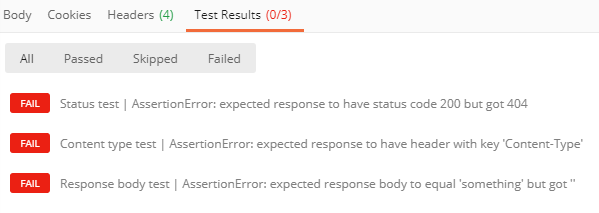

<!-- markdownlint-disable MD041-->
<!-- Is the validation done during subscription renewal? -->

When you send a request to create a subscription to get change notifications through webhooks, Microsoft Graph checks if the **notificationUrl** property in your subscription request is valid. The validation process works as follows:

> [!NOTE]
> If you're subscribing to [lifecycle notifications](/graph/webhooks-lifecycle) as well, Microsoft Graph will also validate the **lifecycleNotificationUrl**.

1. When a subscription is requested, Microsoft Graph encodes a validation token and includes it in a POST request to the notification URL as follows.

    ```http
    Content-Type: text/plain; charset=utf-8
    POST https://{notificationUrl}?validationToken={opaqueTokenCreatedByMicrosoftGraph}
    ```

1. The client must properly decode the URL to get the plain text validation token from Microsoft Graph.

   Escaping any HTML or JavaScript is a good practice because malicious actors can use the notification endpoint for cross-site scripting type of attacks. Microsoft Graph never sends any value containing HTML or JavaScript code.

   In general, treat the validation token value as opaque, as the token format can change without notice.

1. The client must respond with the following characteristics within 10 seconds of step 1:

    - A status code of `HTTP 200 OK`.
    - A content type of `text/plain`.
    - A body that includes the _URL decoded_ plain text validation token.

    > [!IMPORTANT]
    > The validation token must be returned in plain text. If the client returns an encoded validation token, the validation fails.

1. If the endpoint validation fails, Microsoft Graph doesn't create the subscription.

<!--
Additionally, you can use the [Microsoft Graph Postman collection](/graph/use-postman) to confirm that your endpoint properly implements the validation request. The **notificationUrl** validation request in the **Misc** folder provides unit tests that validate the response provided by your endpoint.


-->