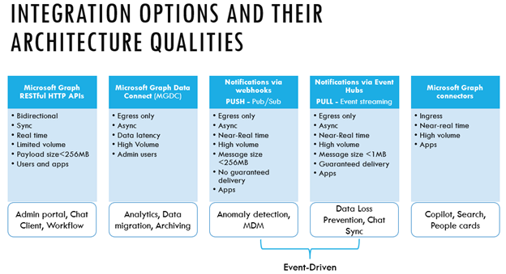

# Common integration patterns with Microsoft Graph

Microsoft Graph is a technology platform that allows organizations to connect their business systems with Microsoft 365 SaaS data and services. Microsoft Graph includes all the options available in modern cloud integration platforms, including interactive APIs, data ingress and egress capabilities, and event-based integration:

- Transactional RESTful HTTP APIs in the Microsoft Graph API provide control and data plane interfaces for various Microsoft 365 SaaS offerings. These APIs support synchronous communication and are granular by nature.  
- Enhanced RESTful HTTP APIs are a subclass of RESTful HTTP APIs designed to provide extra capabilities for effective data extraction. The enhanced APIs consist of Microsoft Teams APIs that enable specialized operations to retrieve large amounts of data, and  Microsoft SharePoint and Exchange Online APIs, which raise throttling limits for paid apps.
- Bulk data export in Microsoft Graph Data Connect. This mechanism follows an ETL (extract, transform & load) pattern, with a data gathering phase that stages data before transferring it in bulk to the customers’ provided storage, serving data with high latency.  
- Event-driven integration in Microsoft Graph API allows client applications to receive notifications of changes or full object data after an event in the Microsoft 365 ecosystem. This PUSH mechanism is supported by webhooks and doesn’t guarantee message delivery or message order. 
- Event streaming integration in the Microsoft Graph API allows client applications to react to activities in Microsoft 365 at their own pace and guarantees the persistence of immutable event data. Microsoft Graph change notifications with Azure Event Hubs support the described pull mechanism. 
- Microsoft Graph connectors enable the ingestion of large amounts of customer data into Microsoft 365 storage, which enriches Microsoft Copilot, the augmentation loop, and search-based Microsoft 365 experiences. These connectors are available through product-specific connectors, such as the Adobe Graph connector for PDFs, or generic-content REST APIs.

Historically, the API platform was the “catch-all” for transactional use cases and application integration. In the last few years, we developed platform options targeting specific use cases: Microsoft Graph Data Connect was built for bulk data egress into customer environments for data insights and analytics, and Microsoft Graph connectors were built for bulk data ingress to support Copilot and Search scenarios. 

The wide range of integration options can confuse both customers who have to choose the best option for their needs and product teams who want to offer their data and services to third-party developers. We suggest beginning with a business scenario and identifying its functional and non-functional requirements, then translating them into a set of requirements that are critical for the architecture and that guide the selection of an integration option.  

Based on many known scenarios in the Microsoft Graph ecosystem, we identified four architecture requirements that have a profound impact on the selection of integration options. These architectural significant requirements are:

- Integration type
- Direction of data flow
- Volume of data
- Data latency

We explain these architecture requirements in more detail as follows:

- We consider application integration to be an integration solution between a client application and Microsoft Graph when the client application depends on both the data and the functionality of the Microsoft 365 services. For example, the /me/sendMail API not only accesses my user data but also sends an email from my account.
- We consider data integration to be an integration solution between a client application and Microsoft Graph when the client application only produces or consumes Microsoft Graph data and doesn't care about the functionality of Microsoft 365 services. All Microsoft Graph integration options support data integration scenarios, but this can create confusion about which option is the best.
- For the direction of data flow, we distinguish outbound flow when customer data leaves the Microsoft Graph compliance boundaries and inbound flow when customer data enters Microsoft Graph.
- Volume of data refers to the amount of customer data processed in a critical period, such as a business day.
- Data latency is the time difference between when data is created and when it is extracted.

Customers who want to integrate with Microsoft Graph data and services need to define these architecture significant requirements for their application scenarios. The following decision tree helps customers and API producers choose the most suitable Graph integration option based on these factors:

Many business scenarios require multiple integration building blocks to implement a solution, for example, Data Loss Prevention (DLP) scenarios may need Microsoft Graph Data Connect integration for the initial data collection and malicious behavior patterns analysis and subsequent event streaming integration for near real-time data ingestion and processing to recognize a potential security incident as quick as possible. **It is our position that when multiple technologies are available on the Microsoft Graph platform our customers should be able to choose a solution based on their constraints and requirements such as complexity, cost, and time to market, and accelerate their path to value.**

To explore each of the integration options in more detail, see the following topics:

- [Interactive applications](./patterns/interactive-applications.md)

- [Augment search experiences](./patterns/augment-search-experience-with-customer-data.md)

- [Analyze Microsoft Graph data](./patterns/analyze-graph-data-in-your-data-storage.md)
  
- [Receive notifications via WebHooks (push)](./patterns/observe-events-and-changes-in-your-data.md)

- [Observe events via Azure Event Hubs (pull)](./patterns/observe-events-via-event-hubs.md)

- [Interactive app with notifications](./patterns/interactive-app-with-change-notifications-via-webhooks.md)

## See also

- [Azure and Microsoft 365 scenarios](https://learn.microsoft.com/en-us/azure/architecture/solutions/microsoft-365-scenarios)
- [Cloud design patterns](https://learn.microsoft.com/en-us/azure/architecture/patterns/)
  
