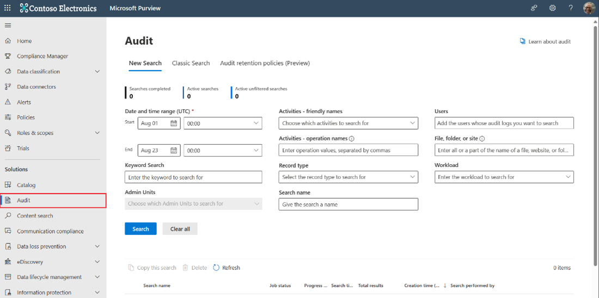
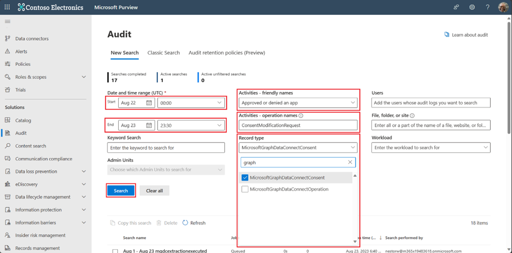
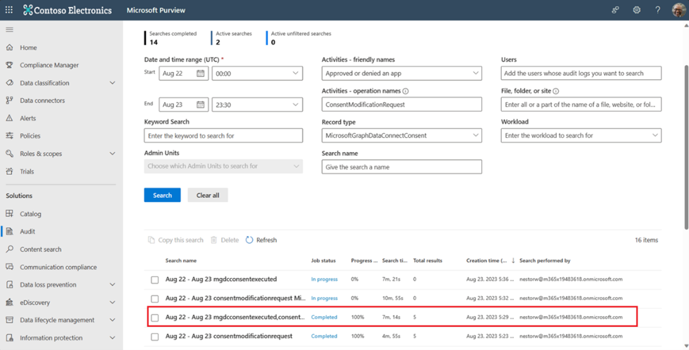
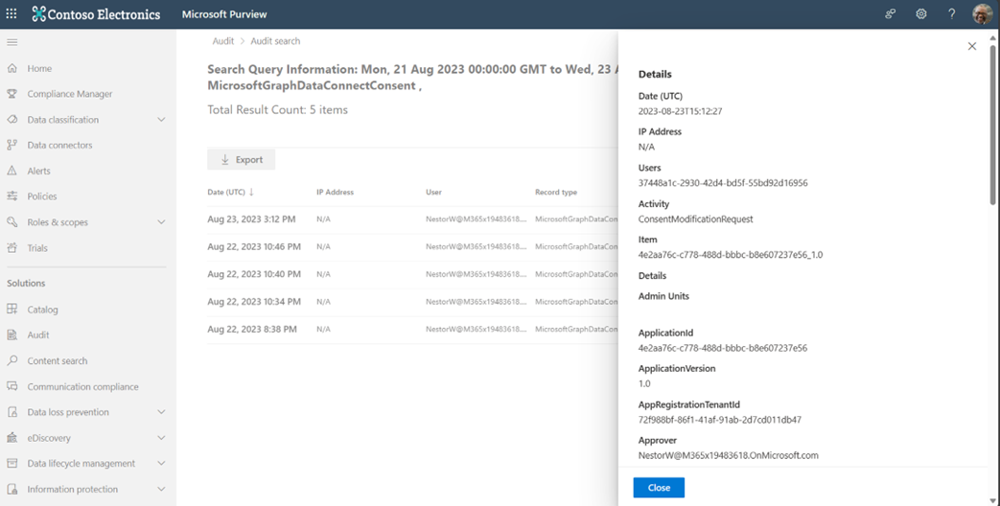
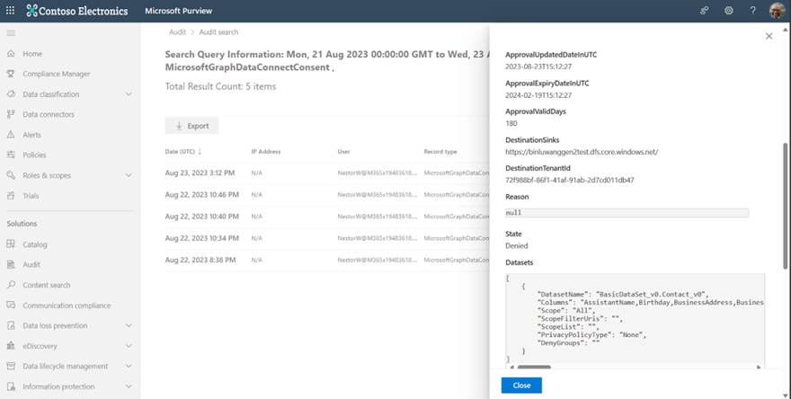

# Overview of how to use Microsoft 365 audit logs with Microsoft Graph Data Connect

## Introduction

Microsoft Graph Data Connect (Data Connect) customers build large-scale data applications with sensitive Microsoft 365 content—following industry-standard best practices for compliance across security, privacy, and governance. Microsoft 365 audit logs offer you a detailed understanding of different applications that access this sensitive data to address any compliance concerns.

Make use of Microsoft 365 audit logs with Data Connect to track authorization and data extraction (operations) events. Read more about improving your overall audit experience with audit logs in the Microsoft Compliance Center using [Audit logs for all Data Connect application access and approvals](https://devblogs.microsoft.com/microsoft365dev/security-governance-and-privacy-built-into-microsoft-graph-data-connect/#audit-logs-for-all-data-connect-application-access-and-approvals). Export your data in CSV files for better clarity and enable audit logs with an E3 license to [Set up Microsoft Purview Audit (Standard)](/purview/audit-standard-setup) or with an E5 license to [Set up Microsoft Purview Audit (Premium)](/purview/audit-premium-setup).

> [!NOTE]
> Microsoft 365 global admins have access to the [Microsoft Purview compliance portal](https://go.microsoft.com/fwlink/p/?linkid=2077149), which hosts Microsoft 365 audit logs. For developers working with Data Connect applications who require access to audit logs, refer to the instructions to [Assign permissions to search the audit log](/purview/audit-standard-setup#step-2-assign-permissions-to-search-the-audit-log).

## Authorization events

Track and audit admin authorization actions on Data Connect apps through M365 audit logs. The following steps outline how to search for authorization events audit logs for Data Connect:

Step 1. Go to the [Microsoft Purview compliance portal](https://go.microsoft.com/fwlink/p/?linkid=2077149), and sign in with the correct privileges.

Step 2. In the left pane of the compliance portal, choose **Audit** as seen in the following image:

.

> [!NOTE]
> For more information on audit log search fields, review the process of how to [Search the audit log](/purview/audit-log-search?view=o365-worldwide#search-the-audit-log) in Microsoft 365.

Step 3. Verify that you've entered values in the following fields:

- **Activities-friendly names: Approved or denied the app**—this filter is specific to scoping down events related to changes in authorization (consent).
- **Activities-operation names: ConsentModificationRequest**—this filter is specific to scoping down events related to changes in authorization (consent).
- **Record Type: MicrosoftGraphDataConnectConsent.**—this filter is specific to all consent events related to Data Connect.
- **Workload: Microsoft Graph Data Connect**—this is the most general filter and scopes down audit logs related to Data Connect-recorded events.
- **Start and end dates**—this is a specific filter that helps scope down the time range of events. Note that the date in the search result is the date the search was performed.

The following image shows the audit log search fields highlighted in the Audit UI of the compliance portal:

.

Step 4. After inputting the above fields, you'll see row(s) ranging from the time period you input previously. To view details on the time range you have selected, click on a row of results, as seen in the following image:

.

Step 5. You'll be directed to a new window pane focusing on search results related to an authorization event, as seen in the following image:

.

Step 6. Click on a sample result to see more details in the left hand pane. You can click on **Export** to export the results to a .csv file format in Excel. In order to thoroughly understand your audit logs and the schema provided in the details, refer to the schema [Data Connect audit logs support](/office/office-365-management-api/office-365-management-activity-api-schema#microsoftgraphdataconnectconsent-complex-type) and [dataset schema](/office/office-365-management-api/office-365-management-activity-api-schema#complex-type-mgdcdataset) as seen in the following images:

.

.

.

## Operation: pipeline run events

Track your data extraction events through pipeline runs that are kicked off in Data Connect applications. 

### How to search for operations audit logs for Data Connect

Step 1. Go to the [Microsoft Purview compliance portal](https://go.microsoft.com/fwlink/p/?linkid=2077149) and sign in.

> [!NOTE]
> Verify beforehand that you have Microsoft 365 admin privileges, or correct authorization to access sensitive log data.

Step 2. In the left pane of the compliance portal, select **Audit**, as seen in the following image:

.

> [!TIP]
> For more information on audit log search fields refer to the process for [searching the audit log in Microsoft 365](/purview/audit-log-search?view=o365-worldwide#search-the-audit-log).

Step 3. Verify that you have the following fields entered:

- **Activities-friendly names: Extraction Run**—this filter is specific to scoping down events related to extraction.
- **Activities-operation names: DataAccessRequestOperation**—this filter is specific to scoping down events to view data access requests.
- **Record Type: MicrosoftGraphDataConnectOperation**—this is a specific filter that scopes down to only the data extraction and pipeline runs for Data Connect.
- **Workload: Microsoft Graph Data Connect**—this is the most general filter and scopes down audit logs only in relation to Data Connect–related recorded events.
- **Start and End Dates**—this is a specific filter that helps to scope down the time range of the events. Note that the date in the search result is the date the search is performed.

The following image shows all of the fields, highlighted:

.

Step 4. After inputting the fields in Step 3, view the details of your audit logs. Click on an audit log row to examine details about the log event. In order to thoroughly understand your audit logs and the schema provided in the details, refer to the schema [Data Connect audit logs support](/office/office-365-management-api/office-365-management-activity-api-schema#microsoftgraphdataconnectconsent-complex-type).
