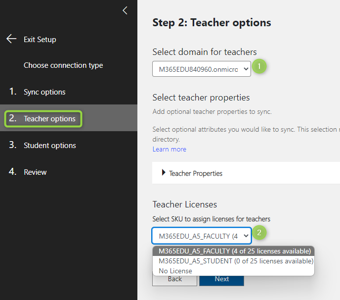
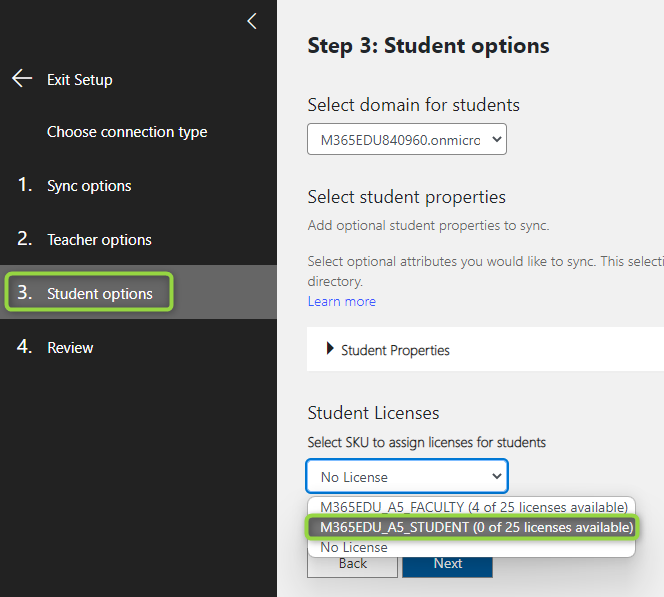

# School Data Sync

Microsoft School Data Sync simplifies class management in Office 365. School Data Sync reads rosters from your SIS and creates classes and groups for Microsoft Teams, Intune for Education, and third-party applications.

To access the School Data Sync Admin Portal launch a private web browser, navigate to sds.microsoft.com, click Sign-In, then enter your O365 Global Admin account credentials.

1. See the CSV files containing demo data: School, Section, Student, Student Enrollment, Teacher and Teacher Roster.

2. After logging in, click + Add Profile in the left hand navigation pane to create a Sync Profile.

   

3. On the Choose Connection Type page, complete the form.
   - Enter a name for your sync profile. This name will be used to identify the sync profile in the SDS Dashboard and cannot be changed once the profile setup is complete. 
   - Select **Upload CVS files** and **CVS files: SDS Format**. 
   - Once complete, click **Start**.

   

4. On the Sync Options page, select the **New users** option. Then click **Upload files** to upload your six CSV files.

   

5. Once uploaded, select an arbitrary stop date in the future, click **Next**.
   - In a production scenario you would usually choose to sync existing users.
   - For a more detailed instruction on the sync process see [How to deploy School Data Sync by using CSV files](https://docs.microsoft.com/SchoolDataSync/how-to-deploy-school-data-sync-by-using-csv-files).

   

6. On the Teacher options page make sure that faculty licenses are selected and click **Next**.

   

7. On the Student options page make sure that student licenses are selected and click **Next**.

   

8. On the Review page, ensure you've made the appropriate selections. If no additional changes are needed, click **Create Profile**.

   

9. Once you create a sync profile, SDS will begin a pre-sync validation process. During this process, SDS will ensure there are no obvious errors with your CSV files.

   

   - If any errors are found during the pre-sync validation process, you will have the option to fix them and re-upload the files before clicking the resume sync button and begin the real synchronization process. 
   - If you receive errors and choose not to update them, you can still choose to resume sync without fixing the errors. Just be aware that SDS can only sustain up to 15,000 errors before the profile will enter a quarantine status.

10. The sync process will take some time and you will be prompted to manually refresh the status page. Press F5 to do so.

    

## Next steps

- [Microsoft Teams setup](/graph/msgraph-onboarding-msteams)