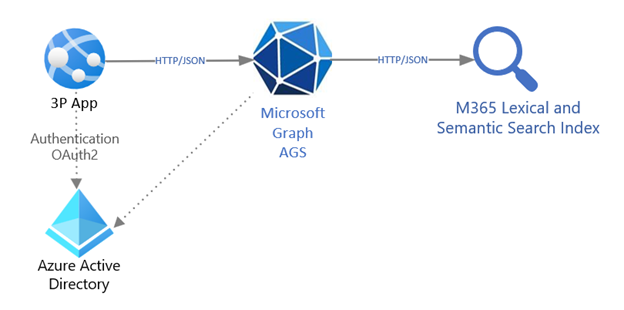

# Analyze Graph data in your data storage

A **business scenario** requires a complex analysis of enterprise collaboration based on the available email and messaging information to improve business processes and productivity.

This business scenario describes a non-interactive use case that relies on a large amount of extracted Microsoft 365 data and has the following **architecturally significant requirements**:

- A data integration type.
- An outbound data flow from Microsoft 365 boundaries to the app.
- A high volume of data spanning multiple months.
- A relatively high data latency as the initial data extract might include a year-old message.
  
The best option for this application is to use the Microsoft Graph Data Connect product. The client needs to set up high-capacity data storage such as Azure Data Lake or Azure Synapse, enable an Azure subscription, and configure an Azure Data Factory or Azure Synapse pipeline.

A simple **reference architecture** for this type of analytical solution is as follows:

## Components

The architecture uses the following components:

- Microsoft Graph Data Connect, which enables extracting Microsoft 365 data at scale with granular data consent, and supports all Azure-native service capabilities such as encryption, geo-fencing, auditing, and policy enforcement.
- Azure Data Factory (ADF), which allows easy construction of ETL (extract, transform, and load) and ELT (extract, load, and transform) processes code-free in an intuitive environment, or writing your own code.
- Azure Data Lake, which lets you persist large amounts of structured and unstructured data in different formats.
- Azure Active Directory, which is required to manage authentication for the Microsoft Graph APIs and supports Delegated and Application permissions to enable OAuth flow.

## Considerations

**Availability**: The client ADF can extract data in bulk on their own schedule or on an ad-hoc basis.

**Latency**: Data latency in this scenario can vary depending on the extraction of historical data or the delivery of more recent data to MGDC storage by asynchronous processes that are often performed as scheduled tasks. Performance of the ADF large data extract is faster than granular HTTP APIs due to ADF's ability to use batching and file transfer.

**Scalability**: This architecture allows you to develop pipelines that maximize data movement throughput for your environment. These pipelines can fully utilize the following resources:

- Network bandwidth between the source and destination data stores
- Source or destination data store input/output operations per second (IOPS) and bandwidth.

**Solution Complexity**: This data egress solution is considered to be of low complexity from the integration perspective since it doesn't require custom code, has a few components, and is tolerant to data latency.
