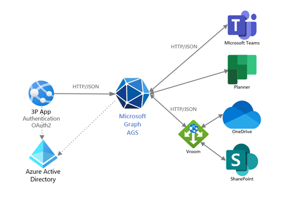

# Interactive applications

A **business scenario** requires a user interface that can create, update, and manage channel messages in real time and that depends on the complex functionality of the M365 services, such as sending or receiving messages from different teams.

This is an interactive scenario, and it has the following **architecturally significant requirements**:

- An application integration type, because it relies on complex M365 functionality.
- A bidirectional data flow between the app and the M365 boundaries.
- A single human interaction usually creates a low volume of data compared to automated systems; however, if there is a large number of users, then the data volume may become high.
- A real-time data operation on the app, with some asynchronous server-side operations, such as delivering email to a remote client.

The best and only choice for this application is to use Microsoft Graph RESTful HTTP APIs. The client app will respond to user actions and can make requests and process the data at its own speed, controlled by the client environment.

Simple **reference architecture** for this app:

## Components

The architecture uses the following components:

Azure App Service, which lets you build and host web apps, mobile back ends, and RESTful APIs in your preferred programming language, without managing infrastructure. It offers auto-scaling and high availability, supports both Windows and Linux, and enables automated deployments from GitHub, Azure DevOps, or any Git repo.
 Azure Active Directory, which is required to manage authentication for the Microsoft Graph APIs and supports Delegated and Application permissions to enable OAuth flow.
SQL Database, which is used to store application data and state and is an optional part of the solution.
Microsoft Graph AGS, which is a single gateway, <https://graph.microsoft.com>, to access Graph RESTful HTTP APIs.
3P App, which implements custom logic and API orchestration.

## Considerations

**Availability**: The client app periodically polls the Graph APIs for data. The client app can make requests and process the data at its own speed, controlled by the client environment.

**Latency**: The client app queries the Graph APIs for data in real time, but there may be some latency depending on the network conditions and the load on the Graph service.

**Scalability**: The client app can scale horizontally by adding more instances to the App Service plan. The Graph APIs can handle a large number of requests, but they also have throttling limits and policies to prevent abuse. The client app should implement retry logic and exponential back off to handle throttling errors gracefully.

**Solution Complexity**: Although this solution might use the Graph SDK, it still requires custom code to poll and process the data. If the data volume is large, sequential processing may not be sufficient and parallel processing may be necessary. For these reasons, we consider this solution to have medium complexity.
