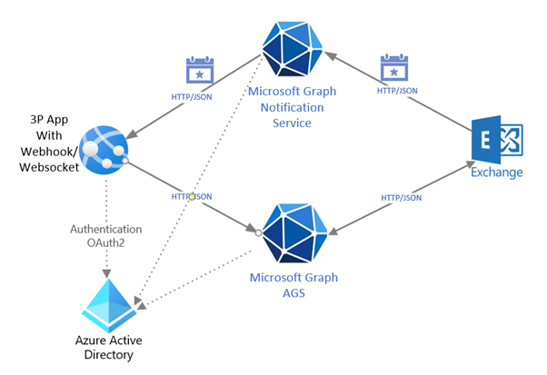

# Build interactive Microsoft Graph apps with change notifications via webhooks

A **business scenario** needs a mobile email client that lets users read, reply, and compose new messages and alerts them of new emails.

This article describes a common Microsoft Graph integration pattern for a business scenario that relies on Microsoft 365 email service data and functionality. It uses Microsoft Graph APIs to read data, call email operations, and receive Microsoft Graph change notifications using webhooks through the WebSocket channel. This scenario has the following architecture requirements:

- An application integration type.
- A bidirectional data flow between Microsoft 365 and the app.
- A low data volume as it serves a single user.
- A medium data latency acceptable for push notifications.
  
This interaction pattern uses multiple Microsoft Graph integration options such as APIs, change notifications, and, optionally, change tracking APIs. To receive change notifications via WebSocket, the app uses the SignalR SDK, which abstracts and simplifies WebSocket management.

The following diagram shows the architecture for this mobile app with a WebSocket webhook.

## Solution components

The solution architecture includes the following components:

- Microsoft Entra, which is required to manage authentication for the Microsoft Graph APIs and supports delegated and application permissions to enable OAuth flow.
- Microsoft Graph notification services, which manages notification subscriptions and delivers change notifications to client apps.
- Microsoft Graph RESTful APIs that are accessed via a single endpoint, `https://graph.microsoft.com`.
- A custom mobile app that implements custom logic and webhooks and communicates with Microsoft Graph. 

## Considerations

The following considerations support the use of this integration pattern:

- **Availability**: The custom app should be highly available on the edge device and can support an offline mode whena reliable internet connection isn't available.

- **Latency**: Microsoft Graph RESTful HTTP APIs usually respond within a second, but the overall latency depends on the internet connection speed. Microsoft Graph notifications are generated within seconds after the change, but their delivery depends on internet connection, mobile vendor SLAs, and webhook availability.

- **Scalability**: Microsoft Graph services are highly scalable, geo-distributed, and support requests and notifications for millions of clients.

- **Solution complexity**: This solution requires custom code to orchestrate APIs, maintain notification subscriptions, and receive change notifications via webhooks. Although this solution doesn't require elasticity, it needs to support users under different network conditions and potentially handle a burst of change notifications. Therefore, this solution is highly complex.

## See also

- [Best practices in cloud applications]([./../webhooks.md](https://learn.microsoft.com/en-us/azure/architecture/best-practices/index-best-practices))
- [Training: Use change notifications and track changes with Microsoft Graph](/training/modules/msgraph-changenotifications-trackchanges)
- [Microsoft Graph fundamentals](/training/basics-learn-graph)

