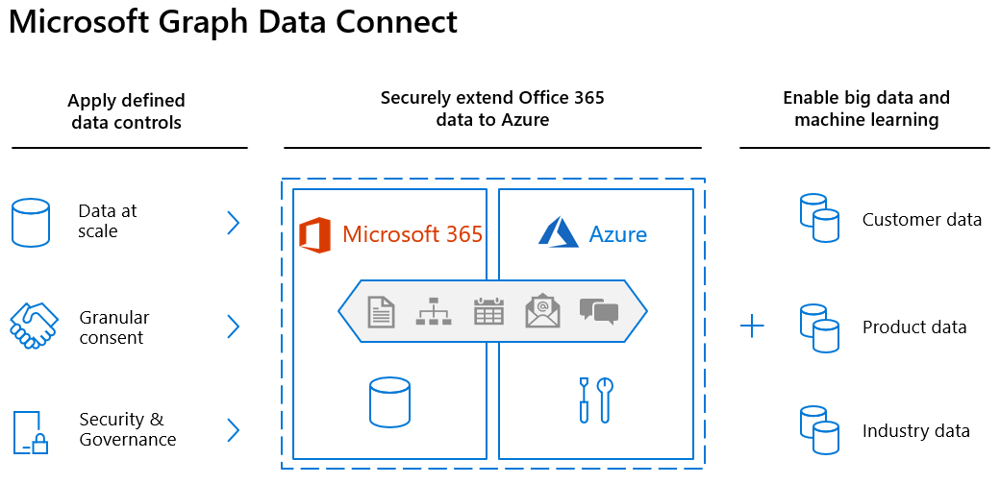

<!-- markdownlint-disable MD002 MD041 -->

Microsoft Graph Data Connect augments our transactional APIs with an intelligent way to access rich data at scale. The data covers how workers communicate, collaborate, and manage their time across all the applications and services from Microsoft 365. 

Microsoft Graph Data Connect is ideal for big data applications and machine learning as it allows you to develop applications for analytics, intelligence, and business process optimization by extending Microsoft 365 data into Azure. Through this offering, you'll be able to take advantage of the vast suite of compute and storage in Azure while staying compliant with industry standards and keeping your data secure.

Microsoft Graph Data Connect uses Azure Synapse or Azure Data Factory to copy Microsoft 365 data to your application’s storage at configurable intervals. It also provides a set of tools to streamline the delivery of this data to Microsoft Azure, letting you access the most applicable development and hosting tools available. 

Microsoft Graph Data Connect also grants a more granular control and consent model: you can manage data, see who is accessing it, and request specific properties of an entity. This enhances the Microsoft Graph model, which grants or denies applications access to entire entities.

Additionally, you can use Microsoft Graph Data Connect to enable machine learning scenarios for your organization. In these scenarios, you can create applications that provide valuable information to your stakeholders, train machine learning models, and even perform forecasting based on large amounts of acquired data.

## Get started

In this tutorial, you will be creating your first Microsoft Graph Data Connect application. Exciting, right? We think so too! To get started, you'll need to set up a few things first.

### Prerequisites

To complete this lab, you will need the following subscriptions or licenses. Please ensure the below:
- The Azure subscription must be in the same tenant as the Microsoft 365 tenant, as Microsoft Graph Data Connect will only export data to an Azure subscription in the same tenant, not across tenants.
- Your Microsoft 365 and Azure tenants must be in the same Microsoft Azure Active Directory tenancy.
- Ensure that two users in your Microsoft 365 tenant have the **Global administrator** role enabled. More information can be found here: [Global Administrator built-in role](/azure/active-directory/roles/permissions-reference#global-administrator).

1. **Microsoft 365 tenancy**

   - If you do not have one, you get one (for free) by signing up to the [Microsoft 365 Developer Program](https://developer.microsoft.com/microsoft-365/dev-program).
   - Multiple Microsoft 365 users with emails sent and received.
   - Access to at least two accounts that meet the following requirements:
      - Must have the **Global administrator** role assigned to you in order to have access to the [Microsoft 365 Admin Center](https://admin.microsoft.com/).
      - Must have an **existing EXO license with E5 SKU**.
         - An E5 instant default sandbox is provided for free from the Microsoft 365 Developer Program or you can also use your own existing E5 instance.

1. **Microsoft Azure subscription**

   - If you do not have one, you can get one (for free) in our [Azure website](https://azure.microsoft.com/free/).
   - The account used to sign in must have the **Global administrator** role granted to it.
   - Ensure your Azure subscription is in the same tenant as your Microsoft 365 tenant and both must be in the same Microsoft AAD tenancy.
   - The Azure subscription must be in the same tenant as the Microsoft 365 tenant, as Microsoft Graph Data Connect will only export data to an Azure subscription in the same tenant, not across tenants. If your Azure subscription is not in the same tenant as your Microsoft 365 tenant, you can associate your subscription with Azure Active Directory in your Microsoft 365 tenant. To do so, follow the steps listed in [Associate or add an Azure subscription to your Azure Active Directory tenant](https://docs.microsoft.com/azure/active-directory/fundamentals/active-directory-how-subscriptions-associated-directory).
  

<!--This can stay for now, please update this once we remove the ASP.NET page-->
1. Make sure you have [Visual Studio](https://visualstudio.microsoft.com/vs/) installed on your development machine.

> [!NOTE]
> The screenshots and examples used in this lab are from an Microsoft 365 test tenant with sample email from test users. You can use your own Microsoft 365 tenant to perform the same steps. No data is written to Microsoft 365. A copy of email data is extracted from all users in an Microsoft 365 tenant and copied to an Azure Blob Storage account that you maintain control over who has access to the data within the Azure Blob Storage.
