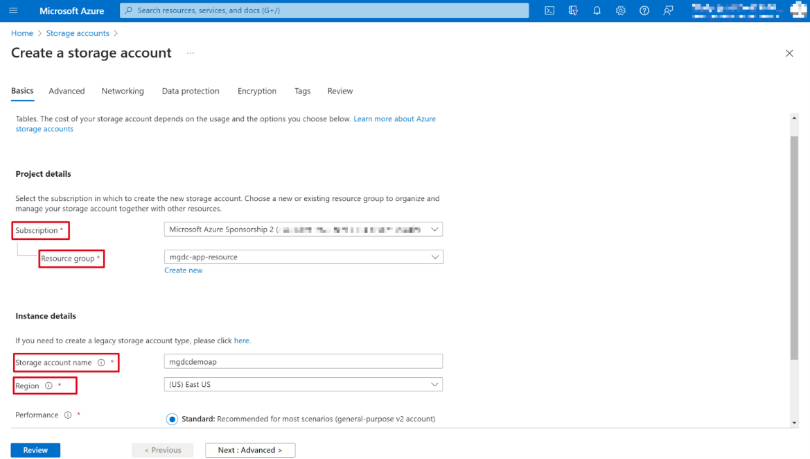
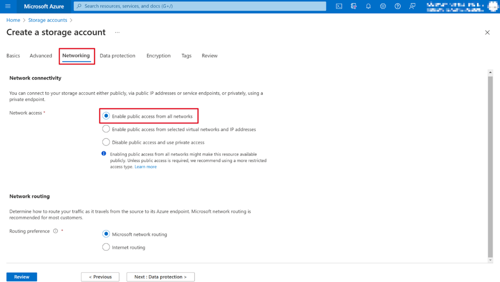
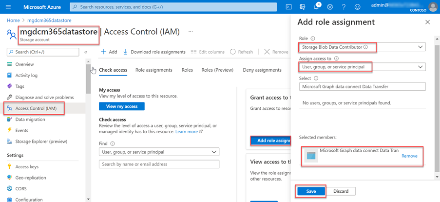
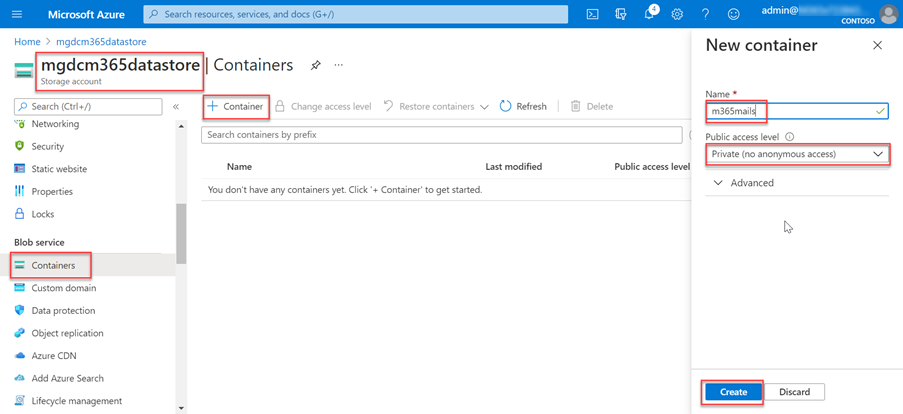

<!-- markdownlint-disable MD002 MD041 -->

In this step you will create an Azure Storage account where Microsoft Graph data connect will store the data extracted from Microsoft 365 for further processing.

1. Open a browser and go to your [Azure Portal](https://portal.azure.com/).

1. Sign in using an account with [**Application Administrator**] (https://docs.microsoft.com/en-us/azure/active-directory/roles/permissions-reference#application-administrator) or [**Application Developer**] (https://docs.microsoft.com/en-us/azure/active-directory/roles/permissions-reference#application-developer) role to your Azure portal.

1. On the sidebar navigation, select **Create a resource**.

1. Find the **Storage Account** resource type and use the following values to create it, then select **Review + create**. For **Performance**, **Redundancy**, and **Advanced Tab**, the values for these fields are an example.

    - **Subscription**: select your Azure subscription
    - **Resource group**: mgdc-app-resource (or select an existing resource group)
    - **Storage account name**: mgdcdemoap (or you can name and select your own storage account)
    - **Region**: [pick an Azure region in the same region as your Microsoft 365 region](https://docs.microsoft.com/en-us/graph/data-connect-datasets#regions)
    - **Performance**: Standard 
    - **Redundancy**: Geo-redundant storage 
    - **Advanced tab**: 
      - **Access tier**: Hot 

    
    
1. After the **Basics** tab, leave the rest of the settings as default.

    > [!NOTE]
    >  Please ensure that within **Networking** tab, only the **Enable public access from all networks** is enabled. While we support other types of network access, we are working on removing additional restrictions required for them. For the time being, please only select the first option. For more questions on additional network access please reach out to dataconnect@microsoft.com.

    

1. Review that the settings match those shown in the previous steps and select **Review** to finalize.

1. After the Azure Storage account has been created, grant the Azure AD application previously created the proper access to it.

    1. Select the **Azure Storage account**.
    2. On the sidebar menu, select **Access control (IAM)**.
    3. Select the **Add** button in the **Add a role assignment** block.
    4. Use the following values to find the application you previously selected to grant it the **Storage Blob Data Contributor** role, then select **Save**.

        - **Role**: Storage Blob Data Contributor
        - **Assign access to**: User, group or service principal
        - **Select**: Microsoft Graph data connect Data Transfer (the name of the Azure AD application you created previously)

        

1. Create a new container in the **mgdcdemoap** Azure Storage account. Please pick the respective Azure Storage based on the one you created earlier in step 4.

    1. Select the **mgdcdemoapp** Azure Storage account (or your account name from step 4).
    2. On the sidebar menu, select **Containers** under the **Blob** service section.
    3. Select the **+Container** button at the top of the page and use the following values and then select **Create**.

        - **Name**: m365mails
        - **Public access level**: Private (no anonymous access)

        
