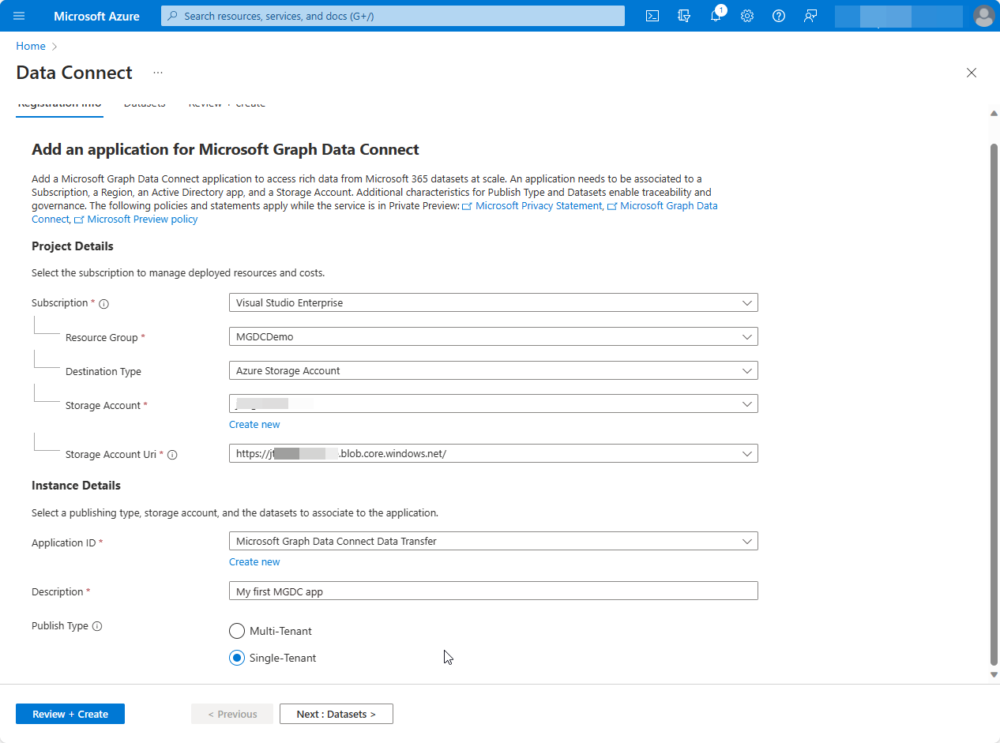
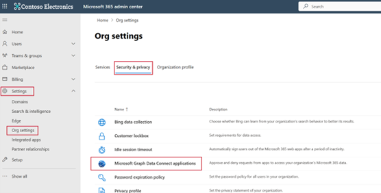

<!-- markdownlint-disable MD002 MD041 -->

As a pre-requisite, Microsoft Graph Data Connect should be enabled in your tenant. We recommended to have an Azure Active Directory (Azure AD) application and storage destination resource created. To register an application with Microsoft Graph Data Connect via the Azure portal, developers are welcomed with a wizard divided into three tabs: **Registration Info**, **Datasets**, and **Review + create**. 

## Register your application with Microsoft Graph Data Connect

### Provide details for the Registration Info tab 

1. Access [Microsoft Graph Data Connect in the Azure portal](aka.ms/mgdcinazure). Moving forward, the experience will be available through the search bar in the [Azure portal](https://portal.azure.com/)

2. Click the "Add" or the "Add a new application" button 

    

3. Follow the **Add** wizard by specifying the project details for the registration. Click **Next : Datasets** once you have completed the following fields

    1.  **Subscription:** Select a subscription in the tenant that will be used exclusively to filter the next four selections utilized to configure the data destination. Required.
        - **Resource Group:** Select the group location for the data storage. Required.
        - **Destination Type:** Select the type of storage from Azure Storage Account or Azure SQL Database Server.
            - If the selected type of storage is SQL Database Server, then it will only support Mapping Data Flows types. Learn more about Mapping Data Flows.
        - **Storage Account:** Select the Azure Storage Account where the data to provision with Data Connect will be located, or create a new Azure Storage Account. Required.
        - **Storage Account Uri:** From the Azure Storage Account selected previously, select the Uri to use (dfs or blob). Required.
            - The Uri is disabled if the Azure Storage Account selected is SQL
    2. **Application ID:** Select from the Azure AD applications in the tenant or create a new one. Required.
    3. **Description:** Text field to provide details on the app registration, for example, project goal, unique identifier, or organization project name. Required.
    4. **Publish Type:** Choose either **Multi-Tenant** or **Single-Tenant**. Required.
        - **Key Vault:** Specify the key vault that will enable the communication between the tenants. Required for Multi-Tenant application registrations.
    
    

### Select dataset and details for the application

Once the **Registration Info** page is completed, it is time to specify the datasets that the app registration will need to query. [Learn more about datasets](/graph/data-connect-datasets).

4. Proceed to select each dataset that the app will request for consent and all or several columns from the dataset depending on the level of granularity and privacy that is required. The following images provide examples:

    - The wizard shows a table that allows the entry of multiple datasets, the selection of columns in those datasets, and further details for consent of multi-tenant apps (scope and scope options). [Learn more about scopes](/graph/data-connect-filtering#user-selection).

    

5. Once completed, click on **Next : Review + create**. If there is missing information for the required fields in the previous tabs, then the button will not be enabled.

    

### Review and create

6. Lastly, the wizard provides a summary page to review the specified details and confirm the creation of the app registration.

    

7. If all required fields are provided, the app registration will appear in the landing page:

    

## Approve your application for Microsoft Graph Data Connect 

1. Open a browser, go to your [Microsoft 365 admin center](https://admin.microsoft.com/), and sign in with your "admin" user.

2. On the left navigation pane, select **Settings > Org settings**. You might have to click **Show all** before you can view **Settings**.

3.	Switch to the **Security & privacy** tab and select the **Microsoft Graph Data Connect applications**.

    

4.	You will land on the Microsoft Graph Data Connect applications portal. You should see the app you just registered with Data Connect in the application summary table with the status **Pre-consent**. 

    <!--  -->

5.	Click on your application to open the application details view. Proceed through the wizard by clicking **Next** to review the application. On the final step, click **Approve** to consent to your registered application accessing the specified data.    

    <!--  -->

6.	The app details view should close and the app summary table should reload with your app listed with Status **Approved**. 

