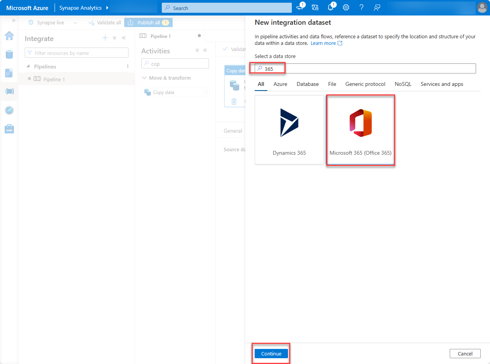
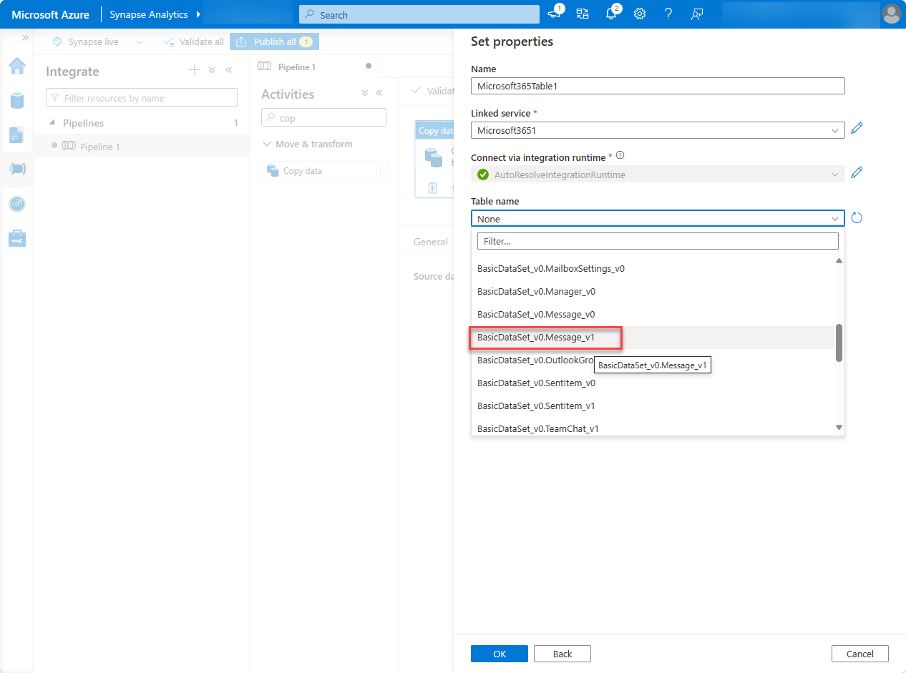
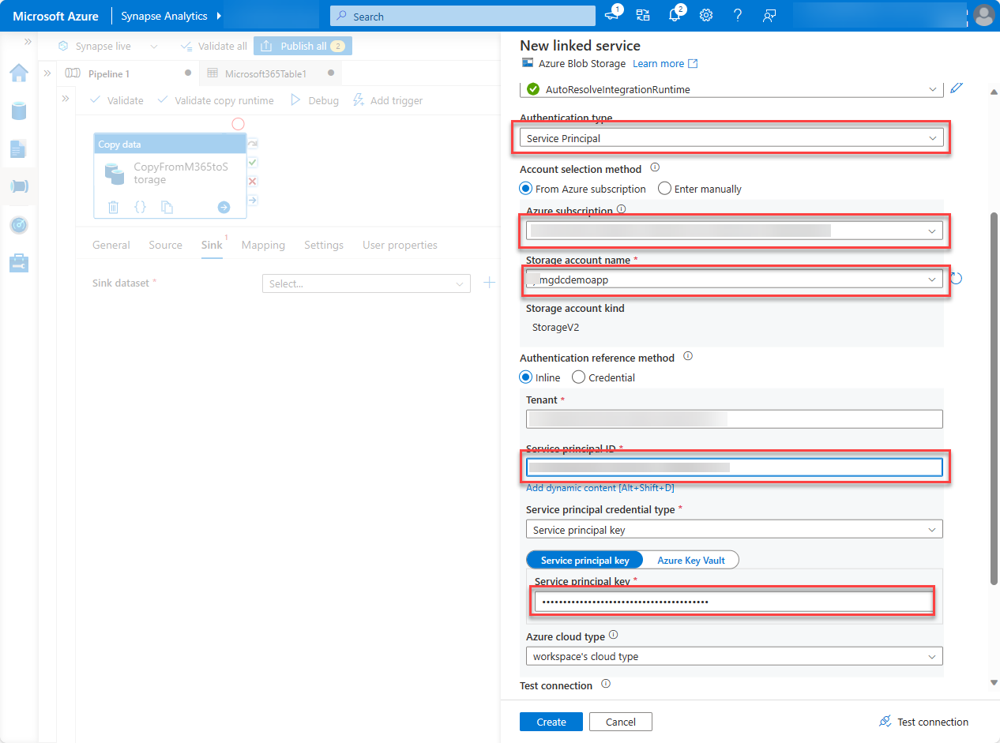
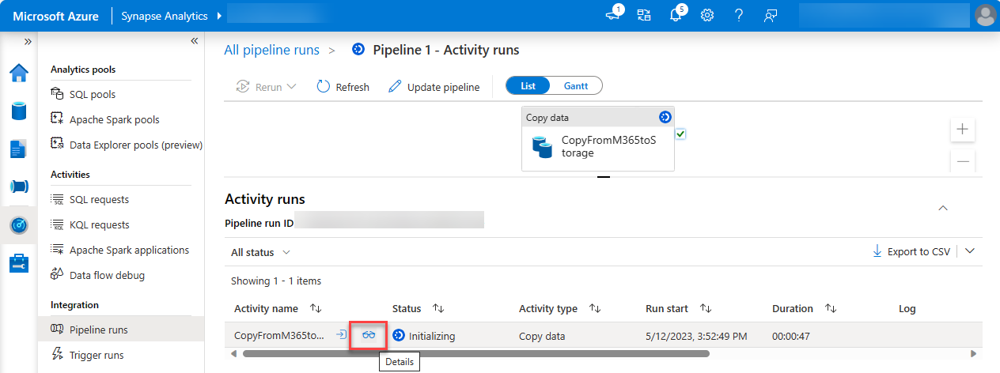

<!-- markdownlint-disable MD002 MD041 -->

You can also use Azure Synapse instead of Azure Data Factory to create a pipeline to extract the data from Microsoft 365 to the Azure Storage account using Microsoft Graph Data Connect (Data Connect).

## Create an Azure Synapse pipeline

1. Open a browser and go to your [Azure portal](https://portal.azure.com/#home).

1. Sign in using an account with **Global Administrator** rights to your Azure and Microsoft 365 tenants.

1. On the sidebar navigation, select **Create a resource**.

1. Find the **Azure Synapse Analytics** resource type and use the following values to create it, then select **Create**.
    - **Subscription:** select your Azure subscription
    - **Resource group:** GraphDataConnect
    - **Region:** [pick an Azure region in the same region as your Microsoft 365 region](/graph/data-connect-datasets#regions)
    - **Workspace name:** m365tostorage
    - **Account name:** synapsedatalstorage
    - **File system name:** flsynapse

        

        

1. After the Azure Synapse Analytics resource is created, select **Go to resource**, open the synapse workspace you've just created (for example, **m365tostorage**), and then select the **Open Synapse Studio** tile to launch the Azure Synapse workspace full screen editor.

    

1. By default, Azure Synapse Analytics will use an integration runtime that is auto-resolving the region. Data Connect requires that your source, destination, and integration runtime exist in the same Microsoft 365 region. Therefore, we recommend that you create a new integration runtime with a fixed region.

    1. Switch to the **Manage (toolbox icon) > Integration runtimes > New**.

    1. Select **Azure, Self-Hosted** and select **Continue**.

        

    1. Select **Azure** for network environment and select **Continue**.

        

    1. Use the following details to complete the form on the final screen and then select **Create**.
        - **Name**: name of your integration runtime
        - **Description**: enter a description
        - **Region**: select the region that matches your Microsoft 365 region

1. Switch from the **Manage (toolbox icon)** to the **Integrate (tube icon)** experience by selecting it from the left-hand navigation.

1. Create a new pipeline by selecting the **Plus** icon, then **Pipeline**.

    

    1. In the search box, enter *Copy data* and then drag the **Copy data** activity from the **Move & transform** section onto the design surface.

        

    1. Select the activity in the designer.

    1. Select the **General** tab and give it a name and description.
        - **Name:** CopyFromM365toStorage
        - **Description:** A description you want.

    1. Select the **Source** tab, then select **New**.

            

    1. Locate and select the dataset **Microsoft 365 (Office 365)**, then select the **Continue** button.

        

    1. Click **Select** under **Linked service** and then click **+New**.

        

    1. In the dialog that appears, select the integration runtime you previously created in the **Connect via integration runtime** dropdown, enter the previously created Azure Active Directory (Azure AD) application's **Application ID** and **Secret ID** in the **Service principal ID** and **Service principal key** fields respectively, and select **Create**.

        

    1. After creating the Microsoft 365 connection, for the **Table name** field, select **BasicDataSet_v0.Message_v1** and then select **OK**.

        

    1. In the **Source** tab, locate the **Date filter** section and use the following values to configure it.
        - **Column name:** CreatedDateTime
        - **Start time (UTC):** select a date sometime prior to the current date
        - **End time (UTC):** select the current date
        - Select **Import schema** in the **Output columns** section.

            

    1. Select the **Sink** tab.
        1. Select the **New** button, select **Azure Blob Storage**, and then select the **Continue** button.

            

            

        1. Select **Binary** as the format for the data and then select the **Continue** button.
        1. Give the dataset the name **M365JsonFile** and follow the next steps to create a new linked service if it does not exist already.

            

        1. Click **Select** under **Linked service** and then click **+New**.
        1. Set the following values in the dialog, then select **Create**.
            - **Authentication type:** Service Principal
            - **Azure subscription:** Select all
            - **Storage account name:** mgdcm365datastore. This is the storage account created earlier in this exercise.
            - **Service principal ID:** enter the ID of the Azure AD application you previously created
            - **Service principal key:** enter the hashed key of the Azure AD application you previously created

                

    1. Next to the **File path** field, select **Browse**.

    1. Select the name of the storage container you created previously, select **OK**, and select **OK** again.

        

1. With the pipeline created, select the **Validate all** button at the top of the designer.

1. After validating (and fixing any issues that were found), select the **Publish all** button at the top of the designer.

# Run the Azure Synapse Analytics pipeline

With the pipeline created, now it is time to run it.

> [!NOTE]
> It can take several minutes for the consent request to appear and it is not uncommon for the entire process (start, requesting consent and after approving the consent completing the pipeline run) to take over 40 minutes.

1. In the Azure Synapse Analytics designer, with the pipeline open, select **Add trigger > Trigger Now** and then select **OK**.

    

1. After starting the job, from the sidebar menu, select **Monitor** to view the current running jobs.

1. On the left-side navigation bar, locate the **Pipeline runs** tab and select it. Select the pipeline under the **Pipeline name** column to view the **Activity runs**. This pipeline will show as _In Progress_.

    

1. After you're in the **Activity runs** view, go to the _Activity runs_ section, which is located in the bottom side of the page.

1. Hover over the **Activity name** and select the goggles option. This will bring up the **Details** tab.

    

1. In the **Details** screen, look for the status of the pipeline activity as highlighted in the following image. In this case you can see that it is in a state of **ConsentPending**. Close the **Details** dialog.

    

1. At this point, the activity run is internally paused until someone manually approves the consent request via the Microsoft 365 admin center or via PowerShell.
