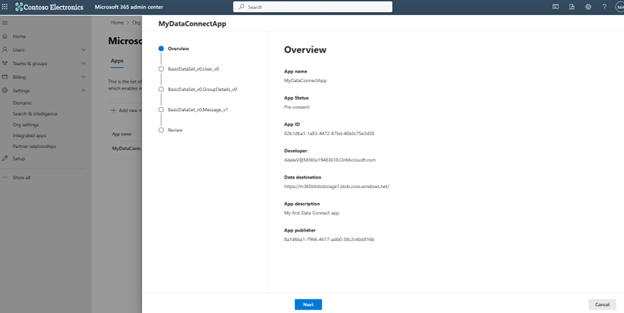
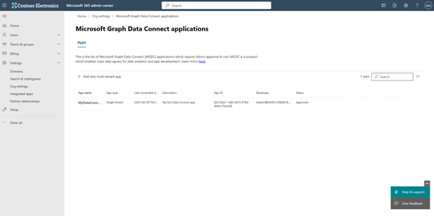

<!-- markdownlint-disable MD002 MD041 -->

## Application Consent Overview 

This documentation is geared towards global administrators who will be responsible for consenting to Microsoft Graph Data Connect (MGDC) apps for your organization. 

The new MGDC app consent experience is built into the [Microsoft 365 admin center](www.admin.microsoft.com). The [entry point for this experience](https://admin.microsoft.com/Adminportal/Home?#/Settings/MGDCAdminCenter) is in **Org settings > Security & Privacy** Tab. 

This is a different entry point from where an admin would opt-in to MGDC. Today, only global administrators may consent to MGDC applications.

## Application Summary View

The landing page of the Microsoft Graph Data Connect applications portal is an at-a-glance view of all MGDC applications you may be interested in. 

You will find both Single-tenant applications and Multi-tenant applications. 

1. Single-tenant applications: Applications that are homed in the your tenant and require access to data from your tenant. These are typically enterprise scenarios.  

2. Multi-tenant applications: Applications that are homed in another tenant and require access to data from your tenant. These are typically ISV scenarios. Reviews these apps extra carefully as consenting to such apps can enable data from your tenant being moved to the app developer’s tenant.

All single-tenant apps will be populated in the table by default. Only approved, denied or expired multi-tenant apps will be included in the table. You may find apps with the following statuses in the table:

1. Pre-consent: App that have not been acted upon yet. This status is only possible for Single-tenant apps. Apps in this state will always fail at runtime. 

2. Approved: App that an admin has approved to access M365 data for your tenant.

3. Denied: App that an admin has denied to access M365 data for your tenant. Apps in this state will always fail at runtime.

4. Expired: App that an admin has approved to access M365 data for your tenant, but the approval expired. Apps in this state will always fail at runtime.

# Application Details View

1. Clicking on any app in the table will launch the app details view with more information on what data the app requires. This wizard experience should walk you through all the relevant data access details and allow you to approve or deny an app at the end. 

    

    

2. The first wizard step presents overview information about the application. 

    - **App owner:** This is the user principal name of the developer who registered the application. 
    - **Data destination:** This is the sink where the data will be delivered. If approved, this app may move the requested data to any location within the listed sink. 
    - **App publisher:** This is the AAD Tenant ID where the app is registered. For Single-tenant apps, this should be the same AAD Tenant ID as your tenant. 

    

    

    

    

3. The next few steps are per-dataset steps – there will be one step per dataset registered in the app. 

    - **Columns:** Specifies which columns the app intends to extract via MGDC. If approved, this app can extract any subset of approved columns for the specified dataset. 

    - **Scope:**  Specifies the scope (i.e., user selection) the app intends to extract via MGDC. Learn more about scopes in MGDC. 

    

    

4. The final wizard step re-iterates some key information on the app in review. At this point, you may either Approve, Decline or Cancel. An action on an app is all or nothing – i.e., consenting to an app means you are consenting to all the access specified in the prior steps.

    

5. When consenting to an app, the following errors are possible. If an unexpected error occurs, the error message will include an error code – please share this error code if you reach out to Microsoft for support. 

    - App approver and owner cannot be the same user.
    - App registration not found. It is possible someone deleted this app.

    

